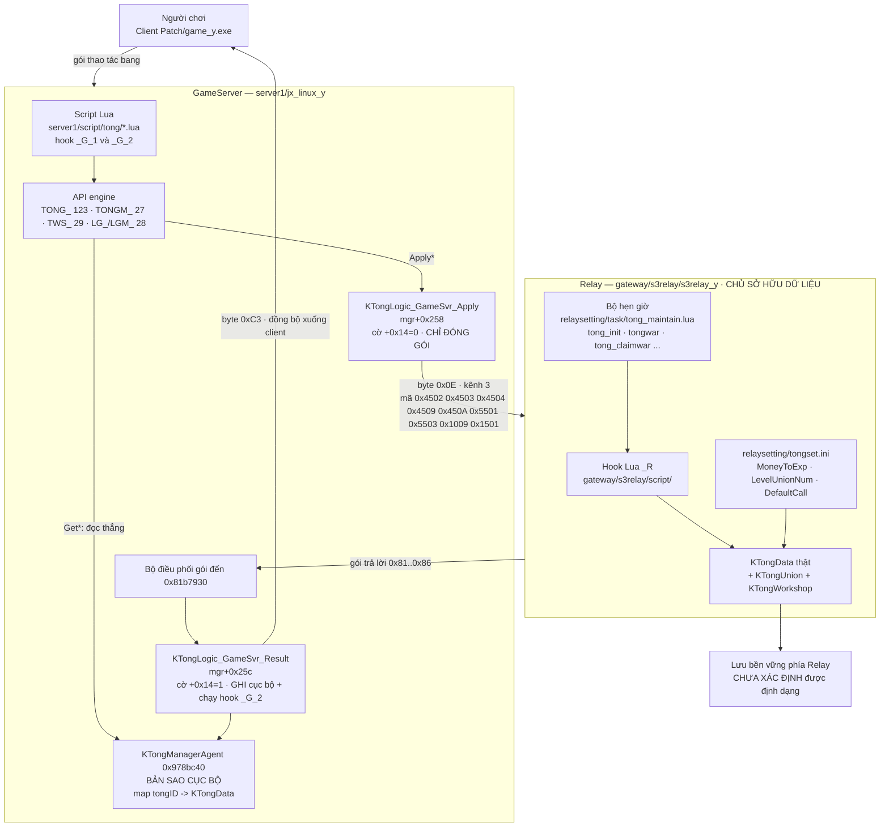

# Hệ thống Bang hội — Server JX2/Kiếm Thế (bản Linux)

> Tài liệu kỹ thuật, viết cho kỹ sư vận hành/sửa server. Mọi khẳng định đều kèm bằng chứng
> (đường dẫn + số dòng, hoặc tên hàm + địa chỉ mã lệnh). Chỗ nào chưa kiểm chứng được thì ghi thẳng.
> Ngày lập: 2026-08-12. Nguồn: dịch ngược `jx_linux_y` + `s3relay_y` và đọc trực tiếp cây script/settings.

---

## 0. Tóm tắt điều hành

Hệ bang hội của server này **không nằm ở GameServer**. GameServer (`D:\ServerLinux\server1\jx_linux_y`)
chỉ giữ **một bản sao đọc-được** của toàn bộ danh sách bang trong singleton `KTongManagerAgent`
(`0x978bc40`), và mọi lệnh ghi đều được **đóng gói gửi sang máy chủ Relay** (`D:\ServerLinux\gateway\s3relay\s3relay_y`)
qua giao thức byte đầu `0x0E`, kênh 3. Relay mới là chủ sở hữu dữ liệu thật, là nơi chạy các hook Lua
hậu tố `_R`, và là nơi có bộ hẹn giờ bảo trì bang.

Quy mô đo được:

| Hạng mục | Số lượng | Bằng chứng |
|---|---|---|
| API engine xuất ra Lua (toàn bộ) | 1661 hàm | `engine_api_full.txt` |
| Họ `TONG_*` (bang) | 123 | `grep -c '^TONG_'` |
| Họ `TONGM_*` (thành viên bang) | 27 | `grep -c '^TONGM_'` |
| Họ `TWS_*` (tác phường) | 29 | `grep -c '^TWS_'` |
| Họ `LG_*` + `LGM_*` (xã đoàn/chiến đội) | 23 + 5 = 28 | `grep -c '^LG_'`, `'^LGM_'` |
| **Tổng 5 họ** | **207 hàm** | |
| Hàm cấp nhân vật liên quan bang (ngoài 207) | ~52 | `GetTongFigure`, `CreateTong`, `Msg2Tong`, … |
| Script Lua bang hội + hoạt động bang | ~13.000 dòng, 300+ file | xem §12.3 |
| Cây script tham gia | **4 cây** (GameServer / Relay-logic / Relay-hẹn-giờ / Client) | xem §0.2 |

Hệ gồm 12 mảng chức năng: mô hình dữ liệu bang–thành viên, vòng đời bang, chức vụ & quyền hạn,
cấp bang + quỹ kiến thiết + bảo trì tuần, cống hiến & dòng tiền, nhiệm vụ bang & 7 tác phường,
6 tuyệt kỹ bang, lãnh địa (11 bản đồ bang), chiến tranh bang / công thành, liên minh bang hội
(`KTongUnion` — **khác** với họ `LG_`), lưu trữ & đồng bộ đa máy chủ, và tích hợp với phần còn lại của game.

### 0.1. Ba điều dễ hiểu sai nhất

1. **`TONG_Apply*` KHÔNG ghi dữ liệu.** Trên GameServer nó chỉ đóng gói và gửi yêu cầu. Việc ghi cục bộ
   + chạy hook xảy ra khi Relay trả lời, do lớp `KTongLogic_GameSvr_Result` xử lý. Xem §11.2.
2. **Họ `LG_/LGM_` KHÔNG phải "liên minh bang hội".** Gốc tiếng Trung là 社团 (xã đoàn) / 战队 (chiến đội) —
   một container bản ghi có tên, dùng chung toàn cụm. Liên minh bang hội thật là `KTongUnion`, nằm ở Relay. Xem §10.
3. **Quyền hạn không phải bitmask** mà là `std::set<DWORD>`; và **Bang chủ bỏ qua mọi kiểm tra quyền**. Xem §3.

### 0.2. Bốn cây script — phải biết đang sửa cây nào

| Cây | Đường dẫn | Tiến trình chạy |
|---|---|---|
| GameServer | `D:\ServerLinux\server1\script\` | `server1\jx_linux_y` |
| Relay — logic bang | `D:\ServerLinux\gateway\s3relay\script\` | `gateway\s3relay\s3relay_y` |
| **Relay — hẹn giờ** | `D:\ServerLinux\gateway\s3relay\relaysetting\task\` | `s3relay_y` |
| Client | `D:\ServerLinux\Patch\script\` | `Patch\game_y.exe` |
| (bản sao cũ) | `D:\ServerLinux\gateway\script\` | — |

Cách nhận biết một file `.lua` chạy ở Relay: nó gọi `GlobalExecute`, `GetGblInt`, `SetGblInt`,
`WriteStringToFile`, `GetTongNameByID` (không hàm nào trong số này có trong 1661 API của `jx_linux_y`,
và cũng không được định nghĩa bằng Lua ở bất kỳ đâu), hoặc nó khai báo khung
`TaskShedule` / `TaskContent` / `GameSvrConnected` / `GameSvrReady`.

### 0.3. Mức độ tin cậy của tài liệu này

- **[CHẮC]** — tôi đã tự dịch ngược hoặc mở file kiểm chứng lại trong lượt này, hoặc đã có 2 lượt phân
  tích độc lập cùng kết luận.
- **[KHÁ CHẮC]** — có bằng chứng mã lệnh/script rõ ràng nhưng chỉ từ một lượt phân tích.
- **[CHƯA KIỂM CHỨNG]** — nhận định còn treo, ghi lại để không mất dấu.

Lưu ý phạm vi: các mảng *lifecycle*, *level-fund*, *offer-contrib*, *stunt*, *territory*, *war*,
*storage*, *integration* trong tài liệu này được tổng hợp gián tiếp qua báo cáo bổ khuyết; những phần
đó được đánh dấu **[KHÁ CHẮC]** hoặc thấp hơn, trừ khi tôi đã tự mở file xác nhận (có ghi rõ).

---

## 1. Sơ đồ kiến trúc



**Đọc sơ đồ:** đường đi của một lệnh ghi luôn là `Lua → API → Apply → Relay → (hook _R) → gói trả lời →
Result → ghi bản sao cục bộ + hook _G_2 → gửi 0xC3 xuống client`. Không có đường tắt "ghi thẳng bộ nhớ".

---

## 2. Mô hình dữ liệu

### 2.1. Đối tượng Bang — `KTongData` [CHẮC]

Con trỏ lấy từ `node+0x14` của `std::map<DWORD tongID, KTongData*>` tại `mgr+0x24`
(header `+0x24`, gốc cây `+0x28`, node trái nhất `+0x2c`, số phần tử `+0x34`).
RTTI `9KTongData` @ `0x82673dc`.

| Offset | Kiểu | Ý nghĩa | Bằng chứng |
|---|---|---|---|
| `+0x10` | DWORD | `tongID` | `0x818a693`, `0x8190a14` |
| `+0x38` | `char[]` | Tên bang | `TONG_GetName` `0x818ad07` `add eax,0x38` |
| `+0x4dc` | `map<DWORD memberID, KTongMember*>` | Danh sách thành viên | `0x81978d5` |
| `+0x4ec` | DWORD | Số thành viên (`_M_node_count`) | `TONG_GetStandFund` `0x818cf90` |
| `+0x4f8` | `map<string tên, KTongMember*>` | Chỉ mục theo tên nhân vật | `0x819828c` |
| `+0x530 + n*24` | 5 × `std::map` | Danh sách thành viên **theo chức vụ** n = 0..4 | `0x81978d7` `lea eax,[esi+esi*2]; shl eax,3` |
| `+0x5a0` | DWORD | Số thành viên nhóm 4 (Ẩn sĩ) | `0x818cf96` `sub edx,[eax+0x5a0]` |
| `+0x5a4 + figure*4` | DWORD[5] | Bộ đếm theo chức vụ (nguồn của `TONG_GetMemberCount(id,figure)`) | `0x81abc3c` / `0x81abc44` |
| `+0x748` | `KStructData` | Đối tượng thuộc tính | `0x81b105a` `add edi,0x748` |
| `+0x768` | `map<WORD fieldID, DWORD>` | **Toàn bộ thuộc tính bang** | `TONG_GetTaskValue` `0x81900f4` |
| `+0x798` | DWORD[256] | Bộ nhớ tạm cục bộ (`TaskTemp`) | `0x81902d8` |

**Bảng FIELD ID** của `map` tại `+0x768` — đã trích lại độc lập 2 lần, trùng khít 100%:

| ID | Tên | ID | Tên | ID | Tên |
|---|---|---|---|---|---|
| 1 | SelfCamp | 17 | PerStandFund | 33 | LWeekGoalValue |
| 2 | CurCamp | 18 | StoredOffer | 34 | LWeekGoalPriceTong |
| **3** | **Money — 32 bit THẤP** | 19 | StoredBuildFund | 35 | LWeekGoalPricePlayer |
| **4** | **Money — 32 bit CAO** | 20 | Day | 36 | CurWeekGoalLevel |
| 5 | Credit | 21 | Week | 41 | WeekBuildFund |
| 6 | Exp (kinh nghiệm bang) | 22 | WeekGoalEvent | 42 | WeekBuildUpper |
| 10 | UnionID (liên minh) | 23 | WeekGoalLevel | 43 | TotalBuildFund |
| 11 | WarState | 24 | WeekGoalTotal | 44 | PauseState |
| 12 | BuildFund | 25 | WeekGoalPlayer | 45 | TongMap |
| 13 | BuildLevel | 26 | WeekGoalValue | 46 | TongMapTemplate |
| 14 | Premium | 27 | WeekGoalPriceTong | 47 | TongMapBan |
| 15 | WarBuildFund | 28 | WeekGoalPricePlayer | 48 | OccupyCityDay |
| 16 | MaintainFund | 29–32 | LWeekGoalEvent/Level/Total/Player | | |

> **Ngân quỹ bang là số 64-bit tách làm HAI field** (3 = thấp, 4 = cao) —
> `TONG_GetMoney` `0x818f9a9` `add eax,[ebp-0x28]; adc edx,[ebp-0x24]`. Vá một nửa sẽ làm tiền nhảy hàng tỉ.

> **`KStructData::SetField` (`0x81a5630`) XOÁ khoá khi giá trị = 0** (`0x81a5677` `test eax,eax; jne`).
> Vì vậy "không tìm thấy khoá" và "giá trị 0" là một. Đây là bẫy khi phân tích gói `0x4502`.

> **Biến nhiệm vụ bang dùng CHUNG map này.** `TASK_ID` phải > 48, nếu không sẽ ghi đè trực tiếp
> BuildFund/Day/… và đồng bộ luôn sang Relay. File khai báo dùng dải từ 1002:
> `D:\ServerLinux\server1\settings\tong\task\tong_task_def.txt`.

### 2.2. Đối tượng Thành viên — `KTongMember` [CHẮC]

RTTI `11KTongMember` @ `0x826717c`.

| Offset | Kiểu | Ý nghĩa | Bằng chứng |
|---|---|---|---|
| `+0x10` | DWORD | `memberID` | `0x819865a` |
| `+0x14` | ptr | Con trỏ ngược (`→+0x14 →+0x10` ra `tongID`) | `0x8198657`–`0x8198670` |
| `+0x38` | `char[]` | Tên nhân vật | `TONGM_GetName` `0x8198d7e` |
| `+0x78` | obj | Đối tượng thuộc tính (map header ở `+0x20` của nó = `+0x98`) | `0x819df32`, `0x81abc85` |
| `+0x98` | `map<WORD, DWORD>` | Thuộc tính + biến nhiệm vụ thành viên | `0x8198c9c` |
| `+0xe8` | `std::set<DWORD>` | **Danh sách quyền** (root `+0xec`, left `+0xf0`, right `+0xf4`, size `+0xf8`) | `0x819842e`, `0x81abcce`–`0x81abcef` |
| `+0xfc` | DWORD | Cờ đang trực tuyến (**biến thời gian chạy, không lưu**) | `TONGM_GetOnline` `0x8199dce` |

Khoá thuộc tính thành viên (đã xác nhận GHI ở khoá 1–12, 15, 16):

| Khoá | Ý nghĩa | Khoá | Ý nghĩa |
|---|---|---|---|
| 1 | Sex | 10 | LWeekGoalOffer (mục tiêu tuần **trước**) |
| 2 | JoinTime | 11 | WeeklyOffer (tuần **này**) |
| 3 | JoinDay (ngày thứ mấy của bang) | 12 | LWeeklyOffer (tuần **trước**) |
| 4 | Money | 15 | LastOnlineDate (đơn vị NGÀY) |
| 5 | **Figure — chức vụ** | 16 | RetireDate (đơn vị NGÀY) |
| 7 | Offer — cống hiến tích luỹ | ≥1001 | Biến nhiệm vụ `TONGMTSK_*` |
| 9 | WeekGoalOffer (tuần **này**) | 10000 | **[LG] thời điểm gia nhập — engine tự ghi, cấm dùng** |

**Engine tự dời số liệu tuần** [CHẮC]: hàm `0x819ed94`–`0x819eee5` đọc khoá `0xb` ghi sang `0xc`,
đọc khoá `9` ghi sang `0xa`, rồi đặt `9 = 0` và `0xb = 0`. Script **không** phải làm việc này cho từng thành viên
(script chỉ dời số liệu cấp BANG ở `tong.lua:117-131`).

> **BẪY LỚN — hai kho biến thành viên song song** [CHẮC]:
> `TONGM_GetTaskValue/ApplySetTaskValue` đọc/ghi map tại `KTongMember+0x98`, nhưng
> `GetTongMTask/SetTongMTask/AddTongMTask` (API cấp nhân vật) đọc/ghi một map **khác** nằm trên
> đối tượng NGƯỜI CHƠI tại `pPlayer+0x5f54` (header) / `+0x5f58` (root) — xem `0x812dcb4`, `0x8128aa4`.
> NPC Tế Đàn dùng đường thứ hai (`script\tong\npc\jitan.lua:58,76`). Sửa bằng đường này không đồng bộ
> với đường kia.

### 2.3. Liên minh — `KTongUnion` [KHÁ CHẮC]

Chỉ tồn tại **phía Relay**. Trong `jx_linux_y` chỉ có `TONG_GetUnionID` (field 10) và tên lớp RTTI `10KTongUnion`.
Toàn bộ nghiệp vụ nằm trong `s3relay_y` (chuỗi lệnh `G_TONG_CREATE_UNION` @`0x81e575f`,
`G_TONG_JOIN_UNION` @`0x81e58b7`, `G_TONG_DISMISS_UNION` @`0x81e58df`, `G_TONG_KICK_UNION` @`0x81e58f4`,
`G_TONG_LEAVE_UNION` @`0x81e5906`). Chi tiết ở §10.2.

### 2.4. Bảng tra cứu hàm — mô hình dữ liệu

| Hàm | Chữ ký | Ý nghĩa |
|---|---|---|
| `TONG_IsExist` `0x8190890` | `(nTongID) -> 0/1` | Bang có tồn tại trong bản sao cục bộ |
| `TONG_GetName` `0x818ac80` | `(nTongID) -> string` | Tên bang; không có thì trả chuỗi rỗng |
| `TONG_Name2ID` `0x818b600` | `(szTongName) -> nTongID` | Tra ID theo tên; chặn tên rỗng |
| `TONG_GetTongCount` `0x818a6c0` | `() -> n` | Số bang, O(1) đọc `mgr+0x34` |
| `TONG_GetFirstTong` `0x818a680` | `() -> nTongID` | Bắt đầu duyệt toàn server; 0 = hết |
| `TONG_GetNextTong` `0x818b4c0` | `(nTongID) -> nTongID` | Bang kế tiếp |
| `TONG_GetTongByRoleName` `0x819a700` | `(szRoleName) -> nTongID` | **QUÉT TUYẾN TÍNH toàn bộ bang** — O(bang × log(tv)), cấm gọi trong vòng lặp |
| `TONG_GetMemberCount` `0x818ff40` | `(nTongID [, nFigure=-1]) -> n` | Số thành viên; `nFigure` 0..4 lọc theo chức vụ |
| `TONG_GetOnlineCount` `0x818fff0` | `(nTongID [, nFigure]) -> n` | Số đang trực tuyến |
| `TONG_GetFirstMember` `0x8197880` | `(nTongID, nFigure) -> memberID` | `nFigure` âm = map tổng; 0..4 = nhóm chức vụ |
| `TONG_GetNextMember` `0x8197c10` | `(nTongID, nMemberID, nFigure) -> memberID` | |
| `TONG_GetTaskValue` `0x81900a0` | `(nTongID, nTaskID) -> number` | Đọc thô map field bang (158 chỗ gọi) |
| `TONG_GetUTaskValue` | `(nTongID, nTaskID) -> number` | Bản không dấu; **0 lời gọi trong script** |
| `TONG_GetTaskTemp` `0x8190260` | `(nTongID, nIdx≤255) -> number` | Mảng tạm cục bộ, **không hook, không đồng bộ** |
| `TONG_SetTaskTemp` `0x818b350` | `(nTongID, nIdx, nValue)` | Mất khi restart, lệch giữa các GameServer |
| `TONGM_IsExist` `0x8198350` | `(nTongID, member) -> 0/1` | Luôn đẩy **số** 1 hoặc 0, **không bao giờ nil** |
| `TONGM_GetName` `0x8198d60` | `(nTongID, nMemberID) -> string` | Đổi ID → tên |
| `TONGM_GetFigure` `0x8199ec0` | `(nTongID, member) -> 0..4` | Chức vụ |
| `TONGM_GetOnline` `0x8199db0` | `(nTongID, member) -> 0/1` | Đọc cờ `+0xfc`, không tra map |
| `TONGM_GetOffer` `0x8198800` | `(nTongID, member) -> DWORD` | Cống hiến tích luỹ (khoá 7) |
| `TONGM_GetTaskValue` `0x8198c80` | `(nTongID, member, wKey) -> int CÓ DẤU` | Giá trị > 2^31 sẽ ra **số âm** |
| `TONGM_GetUTaskValue` `0x8198ba0` | `(nTongID, member, wKey) -> DWORD` | Cùng ô nhớ, đọc không dấu |
| `TONG_GetUnionID` | `(nTongID) -> nUnionID` | Field 10 — ID liên minh |

> Tham số **thứ nhất của MỌI hàm `TONG_*` luôn là `nTongID`** — hàm chung `0x818bdb0` hard-code
> `lua_tonumber(L, 1)`. Ngoại lệ duy nhất: `TONG_GetTongByRoleName`.
> Bộ giải mã của họ `TONGM_*` là `0x8198180`: tham số 2 là **số** → tra map `+0x4dc`; là **chuỗi** → tra map `+0x4f8`.

---

## 3. Vòng đời bang hội

### 3.1. Lập bang — **CHƯA XÁC ĐỊNH ĐƯỢC ĐIỀU KIỆN** [CHẮC về những gì đã loại trừ]

Đây là lỗ hổng nhận thức lớn nhất của toàn bộ khảo sát. Những gì đã **loại trừ**:

| Ứng viên | Kết luận | Bằng chứng |
|---|---|---|
| `settings\tong\tong_setting.ini` `[TongCreate] Level=50 / LeadLeval=20` | **CHẾT** ở cả hai nhị phân | Biến `0x837f3e8`, `0x837f3ec` trên `s3relay_y` mỗi biến đúng 1 tham chiếu (chỉ nơi nạp) |
| `[InstateCheck]` (5 khoá) | **CHẾT** | `0x837f3b0/b4/b8/bc` mỗi biến 1 tham chiếu |
| `script\tong\tong_check.lua` → `tong_check_create()` | **KHÔNG được gọi** | Chuỗi `tong_check_create` không xuất hiện trong **bất kỳ nhị phân nào** của cả 3 cây (`jx_linux_y`, `s3relay_y`, `game_y.exe`, `engine.dll`, `represent2.dll`, `heaven.dll`). Chỉ `tong_check_add` có mặt, và chỉ trong `jx_linux_y` |
| `CheckTongMasterPower` | Thuộc luồng **đổi/giành ghế bang chủ**, không phải lập bang | 1 tham chiếu tại `0x80d1f32`; hàm `0x80d1eb0` `strcmp` tên trong gói (`pkt+0xA`) với tên nhân vật (`role+0x1505`) tại `0x80d1f15` |
| `CreateTong(1)` | Chỉ xuất hiện trong script GM | `script\gmscript.lua:314`, `script\gmcommand_2.lua:40`, `script\global\gm\lbadmin.lua:324` |
| 11 chuỗi `MSG_TONG_CREATE_ERROR01..11` | Chết trên GameServer | (từ lượt phân tích lifecycle) |

**Hệ quả:** luật "cấm lập bang thứ Sáu 18:00–23:50" ở `script\global\tonggetmasterpower.lua:10-12` thực chất
áp cho việc **nhận/giành ghế bang chủ** và ứng cử ở Tế Đàn (`script\tong\npc\jitan.lua:215-218`), **không**
áp cho việc lập bang. Xem câu hỏi mở #1 (§14).

Cấu hình client có tồn tại: `D:\ServerLinux\Patch\ui\ui3_1024\帮会创建单.ini` — cửa sổ lập bang,
`[EditTongName] MaxLen=8` (tên bang tối đa **8 ký tự** phía client, trong khi Relay chấp nhận tới 31 byte
tại `s3relay_y!0x80d15b8`), có `ImageCreateTong` / `ImageChangeCamp` và nút chọn Chính/Tà/Trung lập.

Giai đoạn thử thách bang: `[TongTest] MinMember=16, TimeLong=259200 (3 ngày), ActiveTime=60`
trong `settings\tong\tong_setting.ini`. Khoá `ActiveTime` **sống trên Relay** (`0x837f3ac`, đọc tại `0x80d3631`)
[KHÁ CHẮC]; hai khoá kia chưa xác nhận.

### 3.2. Gia nhập / rời / trục xuất / thoái ẩn [CHẮC — đọc trực tiếp `tong_mix.lua`]

Tất cả nghiệp vụ nằm ở `D:\ServerLinux\server1\script\tong\tong_mix.lua`:

| Thao tác | Hook | Dòng | Luật chính |
|---|---|---|---|
| Thêm thành viên | `MEMBER_ADD_R` | 613–640 | |
| Đổi chức vụ | `MEMBER_SETFIGURE_R` | 642–663 | |
| Trục xuất | `MEMBER_KICK_R` / `_G_1` | 362–419 / 421–490 | Cấm đuổi Figure 0 và 1; tối đa `MAX_KICK_COUNT = 20` lần/ngày (đếm bằng `TONGTSK_MEMBER_KICK_COUNT` / `_DATE`, khai báo ở `tong_task_def.txt` ID 1046/1047) |
| Thoái ẩn / huỷ thoái ẩn | `MEMBER_RETIRE_R` | 496–578 | Chỉ Figure 2 hoặc 3; số ẩn sĩ ≤ 50% (`TONGMEMBER_RETIRE_MAX_RATE = 0.5`); người khác ra lệnh thì mục tiêu phải **offline** VÀ `hôm nay − LastOnlineDate ≥ 7`; huỷ thoái ẩn cần Figure == 4 và `hôm nay − RetireDate ≥ 7` |
| Ghi mốc offline | `MEMBER_ONLINE_R` | 581–592 | `TONGM_ApplySetLastOnlineDate` **chỉ chạy ở nhánh `else` (khi RỜI mạng)** |

**Tiền phạt khi trục xuất** (`tong_mix.lua:386-407`):
- Thành viên mất 5% cống hiến: `TONGM_ApplyAddOffer(nTongID, nMemberID, -(nOffer+19)/20)`
- Bang mất `floor(nOffer*0.6)` khỏi ngân sách kiến thiết dự trữ (thiếu thì lấy tiếp từ ngân sách kiến thiết)
- Bang mất `floor(nOffer*0.4)` khỏi ngân sách chiến bị

> Trong Lua 4, `(nOffer+19)/20` là phép chia **thực**, nhưng engine ép về int bằng `fistp` cắt về 0
> nên kết quả cuối vẫn = `ceil(nOffer/20)` — đúng ý đồ 向上取整 trong chú thích gốc.

**`TONGM_ApplySetRetireDate` chỉ ghi khoá 16.** Việc đổi Figure sang 4 do engine/Relay làm ở đường
riêng (thủ tục SetFigure `0x81abb..`–`0x81abd00`, ghi khoá 5 tại `0x81abc79`). Mối nhân quả giữa hai
việc **chưa nối được bằng bằng chứng tĩnh** — [CHƯA KIỂM CHỨNG].

### 3.3. Giải tán bang — **lệnh GM bị chặn cứng ở tầng engine** [CHẮC]

- `SetCouldDisbandTong` (`0x81bfed0`) chỉ ghi biến toàn cục `0x82e1cec` (lệnh `0x81bff0f`).
- `SetCouldKickTong` → `0x82e1ce8` (`0x81bff5f`); `SetCouldQuitTong` → `0x82e1ce4` (`0x81bffaf`).
- **Không script nào gọi 3 hàm này** (grep toàn cây = 0) ⇒ cả 3 biến vĩnh viễn = 0.
- `GMTongDismiss` (`0x8104d40`) gọi `0x80d0a50` (`0x8104d69`); hàm đó mở đầu bằng
  `mov eax,[0x82e1cec]; test eax,eax; je 0x80d0a79` → **trả về 0 ngay**.

⇒ Lệnh GM "Giải tán bang hội" **không bao giờ chạy**. Sửa biến nil ở `gmcommand_2.lua:108` cũng vô ích.

### 3.4. Bảng tra cứu hàm — vòng đời

| Hàm | Chữ ký | Ý nghĩa |
|---|---|---|
| `TONG_ApplyInit` `0x818fac0` | `(nTongID) -> 0/1` | Khởi tạo bang; hook `INIT_R/_G_1/_G_2` (`tong.lua:19,25,26`); vfunc `+0x0c` |
| `TONG_ApplyKickMember` | `(…)` | Đá thành viên; vfunc `+0x7c` |
| `TONG_ApplyDeleteMember` | `(…)` | Xoá thành viên; vfunc `+0x11c` — **khác gì KickMember thì chưa rõ** |
| `TONGM_ApplySetRetireDate` `0x8198f80` | `(nTongID, member, nDate)` | = `ApplySetTaskValue` khoá 16 |
| `TONGM_ApplySetLastOnlineDate` `0x8199360` | `(nTongID, member, nDate)` | = `ApplySetTaskValue` khoá 15 |
| `TONGM_ApplyAddOffer` `0x8198720` | `(nTongID, member, nDelta)` | Cộng/trừ cống hiến; cho phép âm; vfunc `+0xf8` |
| `TONGM_ApplyAddOfferEx` `0x81909d0` | `(nTongID, nFigure, nOffer)` | **KHÁC chữ ký**: tham số 2 **không** phải thành viên; vfunc `+0xfc`. Trong script đã bị comment (`tong_mix.lua:301`) |
| `CreateTong` | `(…)` | API cấp nhân vật; chỉ script GM dùng |
| `GMTongDismiss` `0x8104d40` | `(szTongName)` | **Vô hiệu** — xem §3.3 |
| `GMTongAddMember` / `GMTongSetMaster` / `GMTongSetLevel` / `GMTongSetExp` / `GMTongSetAddTime` | — | Nhóm lệnh GM, **chưa dịch ngược** |
| `ForceLeaveTong` | — | **Chưa dịch ngược** |
| `GetJoinTongTime` / `SetJoinTongTime` | — | Cấp nhân vật; `GetJoinTongTime` dùng ở **23 file** làm cổng chặn hoạt động |
| `RenameTong` / `QueryTongName` / `GetCurrentTong` / `GetTong` | — | **Chưa dịch ngược** |

---

## 4. Chức vụ & quyền hạn

### 4.1. Năm chức vụ [CHẮC]

Khai báo ở `D:\ServerLinux\server1\script\tong\tong_header.lua:118-122`, và engine dùng đúng con số này:

| Figure | Tên | Trần số lượng | Bằng chứng |
|---|---|---|---|
| 0 | Bang chủ | 1 | `TONG_GetMaster` lấy phần tử đầu nhóm 0 (`0x8197edc`) |
| 1 | Trưởng lão | `MAX_ELDER_COUNT = 7` | `tong_header.lua:134` |
| 2 | Đội trưởng | `MAX_MANAGER_COUNT = 56` | `tong_header.lua:135` |
| 3 | Bang chúng | — | |
| 4 | Ẩn sĩ (thoái ẩn) | ≤ 50% tổng | `TONGMEMBER_RETIRE_MAX_RATE` `tong_header.lua:113` |

Tên hiển thị tiếng Việt: `D:\ServerLinux\server1\lang\vn\stringtable_core.txt:325-329`
và bảng `g_szFigure` ở `tong_mix.lua:294`.
Chức danh tuỳ chỉnh (`Master`, `Director00..06`, `Manager00..55`, `Sex00/01`) nằm ở
`D:\ServerLinux\gateway\s3relay\relaysetting\tongset.ini:33-99` mục `[DefaultCall]` —
chuỗi `DefaultCall` **chỉ có trong `s3relay_y`** (`0x81e3dca`), không có trong `jx_linux_y`.
Bảng chuỗi 32 byte/mục đọc lại tại `0x80c4971` (`shl eax,5; add eax,0x837eb00`).

### 4.2. Quyền hạn là `std::set<DWORD>`, không phải bitmask [CHẮC]

`TONGM_CheckRight` (`0x81983b0`):
1. Tra khoá 5 (Figure) trong map `member+0x98`.
2. **Nếu không có node HOẶC Figure == 0 → trả 1 NGAY** (`0x8198429 je 0x8198498` → `mov eax,1`).
3. Ngược lại `lower_bound(nRightID)` trên `std::set<DWORD>` tại `member+0xe8`.

Bản C++ dùng nội bộ là `0x81a5b10`, có **40 điểm gọi**.

> **Rủi ro dữ liệu:** nếu bản ghi thành viên thiếu trường Figure (dữ liệu hỏng / chưa đồng bộ từ Relay),
> người đó được coi như **BANG CHỦ** và có toàn quyền.

### 4.3. Bảng ID quyền [CHẮC — trích 40 điểm gọi + đối chiếu chuỗi tên thao tác]

| ID | Thao tác | Điểm gọi tiêu biểu |
|---|---|---|
| **1000** | Giao/thu quyền hạn | **Không** đi qua `0x81a5b10`; kiểm **nội tuyến** ở `0x819bf6b` (AddRight), `0x819bd1b` (DelRight), `0x819c2bb` (GiveRight) |
| 1003 | `CHANGECAMP` — đổi trận doanh | `0x81a61c2` → chuỗi `"CHANGECAMP"` @`0x81a61df` |
| 1101 | `MEMBER_REMOVE` / `MEMBER_KICK` / `UPGRADE` (6 handler, ý nghĩa chưa tách bạch) | `0x819cdd0`, `0x819f560`, `0x81a5c60`… |
| 1901 | `MEMBER_KICK` | `0x81a5fdb` → `"MEMBER_KICK"` @`0x81a5ff7` |
| 1902 | `MEMBER_RETIRE` | `0x81abea3` → `"MEMBER_RETIRE"` @`0x81abfbe` |
| 2001 | `UPGRADE` — nâng cấp bang | `0x81a6235` → `"UPGRADE"` @`0x81a62f8` |
| 2003 | `RIGHTID_CITY` | **Chỉ khai báo trong script, engine KHÔNG kiểm, cũng không script nào dùng** |
| 2004 | `MAP_CREAT` / `MAP_SET` / `MAP_BAN` — lãnh địa | `0x81a6126` → `"MAP_CREAT"` @`0x81a615d` |
| 2005 | `RIGHTID_WEEKGOAL` | Chỉ script dùng: `jitan.lua:14,184` |
| 2006 | `STUNT_SET` — tuyệt kỹ | `0x81a644b` → `"STUNT_SET"` @`0x81a64cf` |
| 2007 | `TONGCLAIMWAR` — tuyên chiến | `0x81a605b` → `"TONGCLAIMWAR"` @`0x81a6077` |
| 3001 | Nhóm quỹ: `STOREOFFER2CONTRIBUTION1/2`, `BUILDFUND2WARFUND`, `MONEYFUND2BUILDFUND`, `MONEYFUND_ADD` | 9 điểm gọi |
| 9001 | Tác phường: `LEARN`, `REMOVE`, `DEGRADE`, `UPGRADE`, `CLOSE`, `OPEN`, `SET_USELEVELSET` | 7 điểm gọi |
| *(động)* | ID lấy từ tham số `[ebp+0x14]` | `0x81a175e` — **không gian ID quyền là mở** |

Khai báo phía script: `tong_header.lua:139-142` (`RIGHTID_WORKSHOP=9001`, `RIGHTID_WEEKGOAL=2005`,
`RIGHTID_CITY=2003`, `RIGHTID_STUNT=2006`).

### 4.4. Giao quyền — chỉ Bang chủ → Trưởng lão [CHẮC]

`Apply::GiveRight` (`0x819c160`, vtable Apply `+0x88`):

1. **Cổng chặn đầu tiên — khoá an toàn:** lấy chỉ số người chơi (`0x80d0070`), gọi
   `0x80b29f0(pPlayer, "tbSecurityLock:CheckTong")`, khác 0 → **huỷ yêu cầu** (`0x819c21f`, `0x819c22a`, `0x819c231`).
   Cùng cổng ở `AddRight` (`0x819bed5`).
2. Người thực thi: Figure == 0 **hoặc** có quyền 1000. Sai → `MSG_TONG_NO_OPRIGHT` (`0x819c3e6`, biến `0x978ad9c`).
3. Đích phải là thành viên (`MSG_TONG_TARGET_NOTMEMBER`, biến `0x978ada8`).
4. **Figure của đích PHẢI == 1** (`0x819c384 cmp dword[ecx+0x14],1`); sai →
   `MSG_RIGHT_ASSIGN_NEED_DIRECTOR` = *"Đối phương không phải là trưởng lão, không thể tiếp nhận quyền hạn!"*
   (`lang\vn\stringtable_core.txt:964`).
5. Gửi gói `0x1009` (`0x819c3b2`). Relay trả về → `Result::AddRight` (`0x819c660`) mới thực sự chèn ID vào set.

> **Bảng khởi tạo string-id trong binary LỆCH MỘT NHỊP**: lệnh `mov [global], eax` đứng **trước** `call`
> lấy id của chuỗi kế tiếp, nên phải đọc lùi một bước. Đã kiểm chứng bằng 3 đường độc lập
> (cấu trúc mã, ngữ nghĩa nhánh, thứ tự dòng trong `stringtable_core.txt` 960→968).

### 4.5. Hạ chức khỏi Trưởng lão XOÁ SẠCH quyền [CHẮC]

Trong thủ tục SetFigure: `0x81abc95 cmp [ebp+0x10],1; je 0x81abd0a` — nếu chức vụ mới **khác 1**
thì `0x81abcc9` gọi `0x81a32a0(&member+0xe4, root)` rồi đặt lại `+0xf0/+0xf4 = &member+0xe8`,
`+0xec = 0`, `+0xf8 = 0` → `std::set::clear()`. Hạ Trưởng lão xuống Đội trưởng = **mất trắng mọi quyền**,
phải giao lại từ đầu.

### 4.6. Cơ chế chuyển tiếp khi thiếu quyền [CHẮC]

Khi người thao tác thiếu quyền, engine **không** từ chối ngay mà đi tìm người có quyền đang online:
- `0x819d1fa` gọi `0x81a69a0(pTong, &pMem, 0)` = thành viên đầu tiên có figure 0 (bang chủ);
  kiểm `+0xfc` (online); nếu online → gửi gói **`0x1501`** (`0x819d237`) qua vfunc `+4`.
- Nếu không → `0x819d286` lấy trưởng lão đầu tiên rồi lặp bằng `0x81a8960` (GetNextMemberByFigure,
  duyệt `std::set` memberID tại `KTong + 0x530 + figure*24`, `_Rb_tree_increment` `0x804b31c`).
- Hết danh sách mới báo `MSG_TONG_NORIGHT_MEMBER_ONLINE` = *"Bang chủ và trưởng lão có quyền hạn này
  đều không có trên mạng!"* (`stringtable_core.txt:968`).

### 4.7. Bảng tra cứu hàm — chức vụ & quyền

| Hàm | Chữ ký | Ý nghĩa |
|---|---|---|
| `TONGM_CheckRight` `0x81983b0` | `(nTongID, member, nRightID) -> 0/1` | Bang chủ luôn trả 1; luôn đẩy **số**, không nil |
| `TONGM_ApplyAddRight` `0x8198600` | `(nTongID, member, nRightID) -> BOOL` | vfunc `+0x8c`; **0 lời gọi trong script** |
| `TONGM_ApplyDelRight` `0x81984e0` | `(nTongID, member, nRightID) -> BOOL` | vfunc `+0x90`; **0 lời gọi trong script** |
| `TONG_GetMaster` `0x8197ec0` | `(nTongID) -> string` | Phần tử đầu nhóm chức vụ 0. **Nhóm 0 rỗng → đẩy con trỏ NULL vào `lua_pushstring`** (`0x8197f50`) |
| `GetTongFigure` `0x81145b0` | `() -> 0..4` | Cấp nhân vật |
| `GetTongMemberID` `0x8114600` | `() -> memberID` | Cấp nhân vật |
| `GetTongMaster` `0x81144f0` | `() -> string` | Cấp nhân vật |
| `GetTongTitle` `0x811af00` | `() -> string` | Chức danh, nguồn dữ liệu `[DefaultCall]` ở `tongset.ini` |
| `SetCouldDisbandTong` / `SetCouldKickTong` / `SetCouldQuitTong` | `(0/1)` | **Mã chết** — xem §3.3 |

---

## 5. Cấp bang, quỹ kiến thiết, bảo trì, mục tiêu tuần

### 5.1. Bảng cấp bang [CHẮC — đọc trực tiếp]

`D:\ServerLinux\server1\settings\tong\tong_level_data.txt`, 8 cột:

```
LEVEL  WORKSHOP_UPPER_LEVEL  MAX_WORKSHOP_NUM  WEEK_BUILD_UPPER  UPGRADE_FUND
       UPGRADE_WORKSHOP_NUM  UPGRADE_HI_WORKSHOP_NUM  UPGRADE_HI_WORKSHOP_LEVEL
```

Ví dụ 6 dòng đầu:

| LEVEL | WS_UPPER_LV | MAX_WS_NUM | WEEK_BUILD_UPPER | UPGRADE_FUND | UP_WS_NUM | UP_HI_WS_NUM | UP_HI_WS_LV |
|---|---|---|---|---|---|---|---|
| 0 | 0 | 0 | 3360 | 6720 | 0 | 0 | 0 |
| 1 | 3 | 6 | 3360 | 21600 | 3 | 3 | 3 |
| 2 | 6 | 6 | 6720 | 93600 | 3 | 3 | 6 |
| 3 | 8 | 6 | 10080 | 205200 | 4 | 3 | 8 |
| 4 | 9 | 8 | 16800 | 16800 | 5 | 3 | 9 |
| 5 | 10 | 8 | 25200 | … | | | |

Nghĩa: nâng cấp bang đòi đồng thời **đủ quỹ** (`UPGRADE_FUND`), **đủ số tác phường**
(`UPGRADE_WORKSHOP_NUM`), và **đủ số tác phường đạt cấp cao** (`UPGRADE_HI_WORKSHOP_NUM` cái ở cấp
≥ `UPGRADE_HI_WORKSHOP_LEVEL`). Trần đóng góp kiến thiết mỗi tuần = `WEEK_BUILD_UPPER`.

### 5.2. Bảo trì hằng ngày — bộ hẹn giờ nằm ở RELAY [CHẮC — đọc trực tiếp]

`D:\ServerLinux\gateway\s3relay\relaysetting\task\tong_maintain.lua`:

```lua
INTERVAL_TIME = 1440              -- dòng 5
function TaskShedule()
    TaskInterval(INTERVAL_TIME);  -- dòng 9  · mỗi 1440 phút = 24h
    TaskTime(0, 0);               -- dòng 11 · kích lúc 00:00
    TaskCountLimit(0);            -- dòng 13 · vô hạn lần
end
function TaskContent()
    local nTongID = TONG_GetFirstTong()
    while (nTongID ~= 0) do
        TONG_ApplyMaintain(nTongID)          -- dòng 21
        nTongID = TONG_GetNextTong(nTongID)
    end
end
```

⇒ Khẳng định *"không nơi nào trong Lua gọi `TONG_ApplyMaintain`"* của lượt phân tích level-fund là **SAI** —
lượt đó chỉ quét `server1\script`, bỏ sót cây `relaysetting\task`.

Các script hẹn giờ bang khác trong cùng thư mục (đã liệt kê từ `ls`, **nội dung chưa đọc hết**):
`tong_init.lua`, `cleartongdata.lua`, `tongcontribution_clean_once.lua`, `onetong_writememlist.lua`,
`tongcastle.lua`, `tongwar.lua`, `tongwar_once.lua`, `tong_claimwar.lua` + `tong_claimwar.ini`
(`TaskInterval=300`, `TaskCountLimit=3`), `tong_disciple.lua`, `tong_collectgoods.lua`,
`tong_springfestival.lua`, `banghoithanhbao\`, `tieubangchien\`, `citywar_01..07_*` (28 file),
`citydefence*.lua`, `sevencity_1..5.lua`, `sevencity_cleardata.lua`, `citywar_clearchallenger.lua`.

### 5.3. Nội dung bảo trì [CHẮC — `tong.lua:321-460`]

`MAINTAIN_R` (`D:\ServerLinux\server1\script\tong\tong.lua:321`):

1. Đọc `TONG_GetDay` / `TONG_GetWeek`; quyết định có sang tuần mới không (ngày 0, hoặc thứ Hai,
   hoặc đã 7 ngày kể từ `TONGTSK_LAST_WM_DAY`).
2. `TONG_ApplyAddWarBuildFund(nTongID, -nConsume)`; cộng thống kê `TONGTSK_WEEK_WFCONSUME`.
3. Tính lại chi phí duy trì (tác phường + phí cơ bản theo cấp) → `TONG_ApplySetMaintainFund`.
4. `TONG_ApplySetPerStandFund = floor(nConsume*7 / TONG_GetMemberCount(nTongID,-1))` (dòng 396).
5. Cảnh báo khi `WarBuildFund` < chi phí 7 ngày (tác phường sẽ bị tạm dừng).
6. Sang tuần → `TONG_ApplyWeeklyMaintain(nTongID)` (hook `WEEKLY_MAINTAIN_R` ở `tong.lua:106`,
   dời `WeekGoal*` → `LWeekGoal*` ở dòng 117–131, chú thích gốc 周目标内容移到上周).
7. Bảo trì tuyệt kỹ theo `TONGTSK_STUNT_ID` / `TONGTSK_STUNT_ENABLED` / `TB_STUNTID_INFO`.
8. Kết thúc: `TONG_ApplyAddDay(nTongID, 1)`.

`MAINTAIN_G_1` / `_G_2` = `DefFun1` (`tong.lua:461-462`) → phía GameServer không chặn gì.

**Công thức trợ cấp** [CHẮC]: `TONG_GetStandFund` (`0x818cf10`) không phải field lưu sẵn mà tính tại chỗ:

```
StandFund = (số thành viên [+0x4ec] − số ẩn sĩ [+0x5a0]) × field 17 (PerStandFund)
```
(`0x818cf90 mov edx,[eax+0x4ec]; sub edx,[eax+0x5a0]; imul edx,[esi+0x14]`)

### 5.4. Quỹ bang → Kinh nghiệm bang: **SỐNG, chạy trên Relay** [KHÁ CHẮC]

Đây là mâu thuẫn lớn nhất giữa hai lượt phân tích, đã phân xử:

- Cấu hình sống: `D:\ServerLinux\gateway\s3relay\relaysetting\tongset.ini` mục `[MoneyToExp]`,
  `TimeLong = 750` giây (dòng 14).
- Bộ nạp `s3relay_y` `0x8111494`–`0x8111615` → `0x837f3c4` (MoneyLimit), `0x837f3c8` (NormalMoney),
  `0x837f3cc` (NormalExp), `0x837f3dc` (NormalMemberLimit), `0x837f3e0` (NormalMemberLimitMoney),
  `0x837f3d0` (LimitMoney), `0x837f3d4` (LimitExp), `0x837f3d8` (TestExp).
- **Mỗi biến đều có tham chiếu ĐỌC thứ hai** trong hàm `0x80c3508` (`0x80c352e`, `0x80c3602`,
  `0x80c3641/47/51`, `0x80c3694`, `0x80c36b6`), được gọi từ `0x80d36f0`, cạnh vòng quét định kỳ `0x80d35e6`.
- Thuật toán dựng lại: `money = GetMoney(tong)`; nếu `money > MoneyLimit (1.000.000)` → trừ
  `NormalMoney (5000)`, và nếu `soTV > NormalMemberLimit (100)` thì trừ thêm
  `NormalMemberLimitMoney (50) × (soTV − 100)` (`0x80c3641`–`0x80c3659`); rồi `exp += NormalExp (120)`.
  Ngược lại trừ `LimitMoney`, `exp -= LimitExp`. Bang đang khảo nghiệm (`0x80c7918 != 0`) → `exp -= TestExp`.
  Cuối cùng `0x80c3174(tong, |exp|, exp>=0)`.

**Kinh nghiệm bang không phải di sản chết**: nó quyết định `[LevelUnionNum]`, tức quy mô liên minh,
tức quyền công thành (§10.2).

> Bài học phương pháp: khẳng định *"[MoneyToExp] đã chết hoàn toàn"* sai vì chỉ quét `jx_linux_y`.
> Bang hội không sống ở GameServer. Cùng lỗi này với `[TongTest]`.

### 5.5. Bảng tra cứu hàm — cấp bang & quỹ

| Hàm | Chữ ký | Ý nghĩa |
|---|---|---|
| `TONG_GetMoney` `0x818f900` | `(nTongID) -> number` | Ghép field 4 (cao) + field 3 (thấp) thành int64 |
| `TONG_ApplySetMoney` `0x818fa10` | `(nTongID, nMoney) -> 0/1` | vfunc `+0xbc` → gói **0x4509** (12 byte). **Chặn giá trị âm**: `0x81b1030 test eax,eax; js` → huỷ. **0 lời gọi trong script** |
| `TONG_ApplyAddMoney` `0x818be50` | `(nTongID, nDelta)` | vfunc `+0xc0` → gói **0x450A** (16 byte). **Hàm DUY NHẤT có kiểm toán cấp engine** — xem §13.4 |
| `TONG_GetBuildFund` | `(nTongID)` | Field 12 |
| `TONG_ApplySetBuildFund` `0x8192cd0` | `(nTongID, nValue)` | vfunc `+0xa8`, FIELD_ID = 12 → gói **0x4502** (10 byte). **0 lời gọi trong script** |
| `TONG_ApplyAddBuildFund` | `(nTongID, nDelta)` | vfunc **`+0xb0`** (cộng không dấu) → gói **0x4504** |
| `TONG_ApplyAddWarBuildFund` | `(nTongID, nDelta)` | vfunc `+0xb0` → gói `0x4504` |
| `TONG_ApplyAddPerStandFund` | `(nTongID, nDelta)` | vfunc `+0xb0` → gói `0x4504` |
| `TONG_GetStandFund` `0x818cf10` | `(nTongID) -> number` | **Công thức tính tại chỗ**, không phải field |
| `TONG_GetWeekBuildUpper` | `(nTongID)` | Field 42; **0 lời gọi trong script** |
| `TONG_ApplyUpgrade` `0x818fb40` | `(nTongID) -> 0/1` | vfunc `+0x10`; hook `UPGRADE_R/_G_1/_G_2` (`tong.lua:511,571,596`). **0 lời gọi trong script** ⇒ chỉ kích được bằng gói tin từ client |
| `TONG_ApplyDegrade` `0x818fcc0` | `(nTongID) -> 0/1` | vfunc `+0x14`; hook `DEGRADE_R/_G_1` (`tong.lua:648,669`); 9 lời gọi |
| `TONG_ApplyMaintain` `0x818fe40` | `(nTongID) -> 0/1` | vfunc `+0x18`; gọi từ `relaysetting\task\tong_maintain.lua:21` |
| `TONG_ApplyWeeklyMaintain` `0x818fec0` | `(nTongID) -> 0/1` | vfunc `+0x1c`; hook `WEEKLY_MAINTAIN_R` (`tong.lua:106`) |
| `TONG_ApplyAddDay` / `TONG_ApplySetDay` | `(nTongID, n)` | Field 20 |
| `TONG_ApplySetWeek` | `(nTongID, n)` | Field 21; **0 lời gọi trong script** |
| `TONG_GetExp` / `TONG_GetExpLevel` / `TONG_GetCredit` | `(nTongID)` | Field 6 / 6 / 5 — engine tự nuôi qua `[MoneyToExp]`; `GetExp` và `GetCredit` **0 lời gọi trong script** |
| `TONG_GetLWeekGoal*` (7 hàm) | `(nTongID)` | Field 29–35; `Level/Total/Value` **0 lời gọi** |
| `TONG_ApplySetTaskValue` `0x818ae40` | `(nTongID, nTaskID, nValue)` | vfunc `+0xa8` (89 chỗ gọi) |
| `TONG_ApplyAddTaskValue` `0x8196450` | `(nTongID, nTaskID, nDelta)` | vfunc `+0xac` → gói **0x4503** (57 chỗ gọi) |

---

## 6. Cống hiến & dòng tiền

### 6.1. Ba tầng số liệu cống hiến [CHẮC]

| Tầng | Nơi lưu | Hàm đọc |
|---|---|---|
| **Nhân vật** | Đối tượng người chơi | `GetContribution` (điểm tiêu được), `GetCumulateOffer`, `GetWeeklyOffer` (trần `MAX_WEEK_CONTRIBUTION = 22400`, `tong_header.lua:3`), `GetWeekGoalOffer` |
| **Hồ sơ thành viên trong bang** | `KTongMember+0x98` khoá 7 | `TONGM_GetOffer` |
| **Tuần trước** (ảnh chụp) | khoá 10, 12 | `TONGM_GetLWeekGoalOffer`, `TONGM_GetLWeeklyOffer` |

Chữ **L** = **Last week** (tuần trước), không phải Level/Local — xác nhận bằng chú thích gốc
`tong.lua:124` 周目标内容移到上周 và `jitan.lua:46`.

### 6.2. Các đường tiền [CHẮC — đọc `tong_mix.lua`]

| Nghiệp vụ | Hook `_R` | Hook `_G_1` | Ghi chú |
|---|---|---|---|
| Quyên bạc → ngân sách kiến thiết | `MONEY2BUILDFUND_R` :205 | :238 | `_G_1` kiểm tối thiểu 1 vạn, `GetCash()`, chặn Ẩn sĩ, chặn vượt trần cống hiến tuần, rồi `Pay()` + `AddContribution()` ngay trên nhân vật. `_R` chia `nOffer/10000` vào `WeekBuildFund` (giới hạn theo cấp bang) và phần dư vào `StoredBuildFund` |
| Kiến thiết → chiến bị | `BUILDFUND2WARFUND_R` :195 | | |
| Cống hiến → quỹ dự trữ | `CONTRIBUTION2STOREOFFER_R` :271 | :283 | Chú thích dòng 284: *khi trừ điểm cống hiến thì KHÔNG xin relay, vì relay cũng chạy hàm script tương ứng* |
| Quỹ dự trữ → cống hiến nhóm | `STOREOFFER2CONTRIBUTION1_R` :307 | | `TONG_DistributeOfferToGroup` |
| Quỹ dự trữ → cống hiến cá nhân | `STOREOFFER2CONTRIBUTION2_R` :335 | | `TONG_DistributeOfferToMember` |
| Đặt ngân quỹ | `MONEYFUND_SET_R` :68 | *(không tồn tại)* | Có `AFTER_MONEYFUND_SET_R` :75, chữ ký `(nTongID, nMoneyBeforChange, nChange)` — thứ tự là **(tongID, tiền CŨ, tiền MỚI)** |
| Cộng ngân quỹ | `MONEYFUND_ADD_R` :31 | | Chặn sổ đen: `if IsInBlackList(nTongID) == 1 then … return 0` |

Sổ đen bang: `D:\ServerLinux\server1\settings\tong\blacklist.txt` +
`script\tong\tong_blacklist.lua`. Lưu ý: `tong_mix.lua:24` chỉ `Include tong_blacklist.lua` khi
`MODEL_RELAY == 1`; trong `jx_linux_y` **không có chuỗi `MODEL_RELAY`** ⇒ `IsInBlackList` là logic
**thuần Relay**, không tồn tại ở GameServer. [CHẮC]

Đầu vào quy đổi hoạt động → cống hiến: `D:\ServerLinux\server1\script\tong\contribution_entry.lua`
(chặn Ẩn sĩ ở dòng 65–67; dùng `TONG_SetTaskTemp` làm bộ đệm `TONG_WEEKTEMP/STORETEMP/FUNDTEMP`).

### 6.3. Nghi vấn lỗ hổng kinh tế [CHƯA KIỂM CHỨNG — ưu tiên cao]

Lượt phân tích *offer-contrib* khẳng định `MEMBER_ADD_R` cộng 60/40% cống hiến mang theo vào quỹ bang
mà `MEMBER_REMOVE_R` **không** trừ lại → vòng lặp "rời bang → vào lại" bơm quỹ vô hạn.
**Chưa ai kiểm hai lớp có thể triệt tiêu nó:**
- `gateway\s3relay\relaysetting\task\cleartongdata.lua` và `tongcontribution_clean_once.lua` — hai script
  dọn dữ liệu bang trên Relay, **chưa mở**.
- `TONGM` khoá 2 (`JoinTime`) / member-task 10000 / `GetJoinTongTime` (dùng ở 23 script) làm cổng chặn.

Cách chốt: rời bang → vào lại → đo `TONG_GetStoredBuildFund` trước/sau.

### 6.4. Bảng tra cứu hàm — cống hiến

| Hàm | Chữ ký | Ý nghĩa |
|---|---|---|
| `TONG_ContributeOffer` `0x81968c0` | `(nTongID, nExecutorID, nOffer) -> 0/1` | Bắt buộc ≥ 3 tham số; đọc field 18 (StoredOffer) qua vfunc `+0xa4`, cộng qua `+0xac`, phát tin `+0xf8` |
| `TONG_DistributeOfferToGroup` `0x8197f70` | `(nTongID, nFigure, nOffer) -> 0/1` | Phát cống hiến xuống nhóm chức vụ |
| `TONG_DistributeOfferToMember` `0x8197a70` | `(nTongID, nMemberID, nOffer) -> 0/1` | Phát cho một thành viên |
| `TONG_GetStoredOffer` | `(nTongID)` | Field 18 |
| `TONG_GetStoredBuildFund` | `(nTongID)` | Field 19 |
| `TONG_ApplySetStoredOffer` / `SetStoredBuildFund` / `SetTotalBuildFund` / `SetWarBuildFund` | `(nTongID, n)` | **Cả 4 đều 0 lời gọi trong script** |
| `TONGM_GetOffer` `0x8198800` | `(nTongID, member)` | Cống hiến tích luỹ của thành viên |
| `TONGM_GetLWeekGoalOffer` `0x81998c0` | `(nTongID, member)` | Dùng ở `jitan.lua:55-70` để xét thưởng cá nhân |
| `TONGM_ApplySetLWeekGoalOffer` `0x8199740` / `ApplySetLWeeklyOffer` `0x8199b20` | `(nTongID, member, n)` | Khoá 10 / 12; **0 lời gọi** — engine tự dời |
| `TONG_WriteLog` `0x818b5a0` | `(szText)` | Ghi vào đối tượng log `0x978b560`, bị chặn nếu cờ `0x978b9c8 == 0`. Dùng ở `log.lua:22`, `tong_setting.lua:90` |

---

## 7. Nhiệm vụ bang & tác phường (Workshop)

### 7.1. Biến nhiệm vụ bang [CHẮC]

`D:\ServerLinux\server1\settings\tong\task\tong_task_def.txt` — 5 cột
(`TASK_ID_FIRST`, `TASK_ID_LAST`, `TASK_NAME`, `SYNC_FLAG`, `TASK_DESCRIBE`), 9 mục:

| ID | Tên |
|---|---|
| 1002 | Phần thưởng mục tiêu tuần |
| 1003 | Phần thưởng cá nhân mục tiêu tuần |
| 1004 | Điểm cống hiến mục tiêu cá nhân tuần trước |
| 1005 | Phần thưởng cá nhân tuần trước |
| 1006 | Mức độ hoàn thành mục tiêu tuần trước (`SYNC_FLAG = 1` — đồng bộ với client) |
| 1007 | Thời gian thăng cấp ứng cấp sử dụng lần trước (số ngày) |
| 1043–1044 | Hoạt động Phong Hầu Anh Hùng Lệnh |
| 1046 | Bộ đếm trục xuất thành viên |
| 1047 | Ngày của bộ đếm trục xuất |

`member_task_def.txt` và `workshop_task_def.txt` **chỉ có dòng tiêu đề, không có mục nào** —
biến nhiệm vụ thành viên/tác phường được khai báo trong Lua (`tong_header.lua:52-59`,
`TONGMTSK_WEEK_GOAL_PRICE=1001`, `TONGMTSK_DAILY_PRICE=1002`, `TONGMTSK_TOMASTER=1003`,
`TONGMTSK_SELFCOMMEND_TIME=1037`, `TONGMTSK_MASTERCANDIDATE=1038`,
`TONGMTSK_INICONTRIBUTIVENESS=1039`, `TONGMTSK_CONTRIBUTIVENESS=1040`).

### 7.2. Bảy tác phường [CHẮC — đọc `workshops.txt`]

`D:\ServerLinux\server1\settings\tong\workshop\workshops.txt`, cột
`TYPE / NAME / DESC / COEFFICIENT / OPEN_ICON / CLOSE_ICON / UNFOUNDED_ICON / SCRIPT`:

| TYPE | Tên | Hệ số | Script logic | Bảng cấp |
|---|---|---|---|---|
| 1 | Khu Binh giáp | 1.4 | `script\tong\workshop\ws_bingjia.lua` | `bingjia_level_data.txt` |
| 2 | Khu Thiên Công | 1.0 | `ws_tiangong.lua` | `tiangong_level_data.txt` |
| 3 | Khu Mặt nạ | 1.2 | `ws_mianju.lua` | `mianju_level_data.txt` |
| 4 | Khu Luyện tập (Thí Luyện) | 1.0 | `ws_shilian.lua` | `shilian_level_data.txt` |
| 5 | Khu Thiên Ý | 0.8 | `ws_tianyi.lua` | `tianyi_level_data.txt` |
| 6 | Khu Lễ vật | 1.0 | `ws_liwu.lua` | `liwu_level_data.txt` |
| 7 | Khu hoạt động | 0.6 | `ws_huodong.lua` | `huodong_level_data.txt` |

Cộng thêm `workshop_level_data.txt` (bảng cấp chung). Mã hạ tầng ở
`script\tong\workshop\workshop_def.lua`, `workshop_head.lua`, `workshop_logic.lua`,
`workshop_setting.lua`, `tongcolltask.lua` (12 file / ~3.792 dòng).
Mỗi tác phường có một NPC tổng quản: `script\tong\npc\{bingjia,tiangong,mianju,shilian,tianyi,liwu,huodong}_zongguan.lua`
+ `zhandouqu_zongguan.lua`.

Quyền thao tác tác phường = **9001** (`RIGHTID_WORKSHOP`), engine kiểm ở 7 handler:
`LEARN` `0x81a6620`, `REMOVE` `0x81a6d60`, `DEGRADE` `0x81a6ed0`, `UPGRADE` `0x81a70c0`,
`CLOSE` `0x81a72b0`, `OPEN` `0x81a7420`, `SET_USELEVELSET` `0x81a9f70`.

### 7.3. Bảng tra cứu hàm — họ `TWS_` (29 hàm) [KHÁ CHẮC — có tên, **chưa dịch ngược hàm nào**]

| Hàm | Chữ ký suy ra | Ý nghĩa |
|---|---|---|
| `TWS_IsExist` | `(nTongID, nType) -> 0/1` | Tác phường có tồn tại |
| `TWS_IsOpen` | `(nTongID, nType) -> 0/1` | Đang mở hay đóng |
| `TWS_GetType` | `(…) -> nType` | Loại tác phường |
| `TWS_GetLevel` | `(nTongID, nType) -> n` | Cấp tác phường |
| `TWS_GetWorkshopCount` | `(nTongID) -> n` | Số tác phường của bang |
| `TWS_GetFirstWorkshop` / `TWS_GetNextWorkshop` | `(…)` | Duyệt danh sách |
| `TWS_GetDayOutput` / `TWS_ApplySetDayOutput` / `TWS_ApplyAddDayOutput` | `(…)` | Sản lượng ngày |
| `TWS_GetUseLevel` / `TWS_ApplySetUseLevel` | `(…)` | Cấp sử dụng |
| `TWS_GetUseLevelSet` / `TWS_ApplySetUseLevelSet` | `(…)` | Bộ cấp sử dụng (quyền 9001) |
| `TWS_GetBuildingNpc` / `TWS_SetBuildingNpc` | `(…)` | NPC công trình |
| `TWS_GetTaskValue` / `TWS_GetUTaskValue` / `TWS_ApplySetTaskValue` / `TWS_ApplyAddTaskValue` / `TWS_ApplyAddUTaskValue` | `(…)` | Biến nhiệm vụ tác phường |
| `TWS_ApplyAdd` / `TWS_ApplyRemove` | `(…)` | Lập / dỡ tác phường |
| `TWS_ApplyOpen` / `TWS_ApplyClose` | `(…)` | Mở / đóng |
| `TWS_ApplyUpgrade` / `TWS_ApplyDegrade` | `(…)` | Nâng / hạ cấp |
| `TWS_ApplyMaintain` | `(nTongID, nType)` | Bảo trì |
| `TWS_ApplyUse` | `(…)` | Sử dụng |

> **Toàn bộ họ `TWS_` chưa được dịch ngược.** Chữ ký ở trên là suy ra từ tên + đối chiếu mẫu của họ
> `TONG_`/`TONGM_`; cần xác minh trước khi dựa vào.

---

## 8. Tuyệt kỹ bang (Stunt)

### 8.1. Bảng cấu hình [CHẮC — đọc trực tiếp]

`D:\ServerLinux\server1\settings\tong\tongstunt_setting.txt`, cột
`StuntID / StuntName / MaxMemberCnt / MaxStuntCntPer / Cycle / Consume / RightLimit / SkillID / Describe`:

| StuntID | Tên | MaxMemberCnt | MaxPer | Cycle | Consume | RightLimit | SkillID |
|---|---|---|---|---|---|---|---|
| 1 | Phượng Hoàng Ấn | 300 | 2 | 4 | 6000 | 2 | 739 |
| 2 | Luyện vô hồn | 300 | 5 | 4 | 6000 | 2 | 740 |
| 3 | Vô Song Sát Trận | 10 | 2 | 4 | 6000 | 1 | 741 |
| 4 | Đạo Chu Tiên | 300 | 1 | 4 | 6000 | 2 | 742 |
| 5 | Vũ thần tự phù | 2 | 2 | 4 | 6000 | 1 | 743 |
| **(thiếu 6)** | — | — | — | — | — | — | *(744?)* |
| 7 | Hoàng Kim Lệnh | 2 | 2 | 4 | 6000 | 1 | 745 |

`Cycle = 4` = bảo trì hằng tuần; `Consume = 6000` ngân sách; `RightLimit`: 1 = chỉ cấp lãnh đạo nhận được.

### 8.2. Lỗi dữ liệu đã xác định [CHẮC]

**Thiếu hàng `StuntID = 6`** chính là nguyên nhân gốc của lỗi `TB_STUNTID_INFO[6].skillid` = nil tại
`D:\ServerLinux\server1\script\tong\tong.lua:311-313` — đây là **lỗi dữ liệu, không phải lỗi vòng lặp**.
Nếu quy trình bảo trì tuần duyệt StuntID 1..7 tuần tự thì mỗi lần chạm ID 6 sẽ ném lỗi Lua và **bỏ dở
phần còn lại của hàm**.

### 8.3. Bảng tra cứu hàm — tuyệt kỹ

| Hàm | Chữ ký | Ý nghĩa |
|---|---|---|
| `TONG_ApplySetStunt` | `(nTongID, nStuntID)` | vfunc **`+0x38`** (ngoại lệ, không dùng `+0xa8`); hook `STUNT_SET`, quyền **2006**, handler `0x81a6420` |
| `TONG_GetStunt` *(nếu có)* | — | **Chưa xác minh có hàm đọc riêng** — số liệu đọc qua `TONG_GetTaskValue(TONGTSK_STUNT_ID)` |
| `TONGM_CheckRight(..., 2006)` | | Cổng kiểm quyền, dùng ở `city_totempole.lua:359`, `tong_totempole.lua:74,375` |
| `TONG_ChangeAllMemberFeature` `0x81907a0` | `(nTongID, nFeature, nTime)` | Đổi ngoại hình toàn bang; vfunc `+0x100`; dùng ở `script\item\tongmask.lua:38` (`nfeature, 194400` giây = 54h) |

Biến trạng thái: `TONGTSK_STUNT_ID`, `TONGTSK_STUNT_ENABLED` (đọc qua `TONG_GetTaskValue`).
NPC liên quan: `script\tong\npc\tong_totempole.lua`, `city_totempole.lua` (Đồ Đằng).

---

## 9. Lãnh địa bang (bản đồ bang)

### 9.1. Danh sách bản đồ [KHÁ CHẮC — từ `addtongnpc.lua`]

`D:\ServerLinux\server1\script\tong\addtongnpc.lua`:
- Dòng 36–52: **4 bản đồ công cộng** `{586, 595, 596, 597}` + **7 mẫu bản đồ động**
  `{587, 588, 589, 590, 591, 593, 594}` (**thiếu 592**).
- Dòng 55–61: tên tiếng Việt của các bản đồ.
- Dòng 4 ghi rõ bằng tiếng Trung: *script này GS và relay đều phải đồng bộ cập nhật*.

Thư mục logic: `D:\ServerLinux\server1\script\tong\map\` (28 file / ~514 dòng),
trong đó `map_management.lua`.

### 9.2. Bảng tra cứu hàm — lãnh địa

| Hàm | Chữ ký | Ý nghĩa |
|---|---|---|
| `TONG_ApplyCreatMap` | `(nTongID, …)` | Tạo bản sao bản đồ bang; vfunc `+0x30`; hook `MAP_CREAT`, quyền **2004** (`0x81a6126`) |
| `TONG_ApplySetTongMap` | `(nTongID, nMapID)` | vfunc **`+0x34`** (ngoại lệ); field 45; hook `MAP_SET` |
| `TONG_ApplySetTongMapBan` | `(nTongID, n)` | vfunc **`+0xe0`** (ngoại lệ); field 47; hook `MAP_BAN` |
| `TONG_ApplyDeleteMap` | `(nTongID)` | vfunc `+0xd4`. **0 lời gọi trong script** |
| `TONG_GetTongMap` | `(nTongID)` | Field 45 (hàm đọc cả 45 và 46 — công thức kết hợp **chưa rõ**) |
| `TONG_GetTongMapTemplate` | `(nTongID)` | Field 46 |
| `TONG_GetTongMapBan` | `(nTongID)` | Field 47 |

> Cảnh báo cũ *"`map_management.lua:144` gọi `TONG_ApplyChangeMap` không tồn tại → mìn"* là **SAI**:
> dòng đó là `--\tTONG_ApplyChangeMap(nTongID, nMapCopyId);`, nằm trong cả một **hàm đã bị chú thích**
> (dòng ~125–145, dòng 145 là `--end`). Tương tự `card_shitu.lua:115` cũng là dòng comment. [CHẮC]

NPC trong bản đồ bang: `script\tong\npc\tong_chefu.lua` (Xa phu), `tong_chuwuxiang.lua`,
`jitan.lua` (Tế Đàn), `muren_death.lua` (Mộc nhân).
Vị trí NPC: `D:\ServerLinux\server1\settings\tong\npcpos.txt`.

### 9.3. Kho bang — **KHÔNG TỒN TẠI** [CHẮC]

`D:\ServerLinux\server1\script\tong\npc\tong_chuwuxiang.lua` (帮会储物箱 = "rương chứa đồ bang hội")
toàn bộ nội dung là `function main() OpenBox(); end`, với `OpenBox` = `0x81299f0` (mở **rương cá nhân**).
⇒ Không có kho chung của bang. NPC chỉ là điểm mở rương cá nhân đặt trong bản đồ bang.

---

## 10. Chiến tranh bang, công thành chiến, liên minh

### 10.1. Chiến tranh bang [KHÁ CHẮC — chỉ khảo sát ở mức cấu trúc]

| Thành phần | Đường dẫn / địa chỉ |
|---|---|
| Tuyên chiến — quyền 2007 | Engine `0x81a605b` → chuỗi `"TONGCLAIMWAR"` `0x81a6077`; hẹn giờ `gateway\s3relay\relaysetting\task\tong_claimwar.lua` + `.ini` (`TaskInterval=300`, `TaskCountLimit=3`) |
| API cấp nhân vật | `TongClaimWar`, `GetCityWarTongCamp`, `IsTongWarMap`, `NumOfSignUpTongs`, `GetSignUpTongName` — **chưa dịch ngược** |
| Field trạng thái | 11 (`WarState`), 48 (`OccupyCityDay`) |
| Thông báo | `stringtable_core.txt:1021` *"Chỉ có bang chủ mới có thể tuyên chiến bang khác"* |
| Công Thành Chiến | `server1\script\missions\citywar_global\` + `citywar_city\` + `citywar_arena\` — 46 file / ~3.315 dòng |
| Thất Thành Chiến | `server1\script\missions\sevencity\` + `mission\sevencity\` — 13 file / ~2.479 dòng |
| Thủ thành | `missions\newcitydefence\` + `citydefence\` — 95 file / ~3.479 dòng |
| Tiểu Bang Chiến | `missions\tongwar\` + `event\tongwar\` — 23 file / ~3.073 dòng |
| Bang Hội Thành Bảo | `missions\tongcastle\` + `mission\tongcastle\` — 10 file / ~2.301 dòng |
| Bang Hội Cổ Tháp | `missions\tong_guta\` — 40 file / ~4.694 dòng |
| Olympic bang | `missions\olympic\tong\` — 6 file / ~488 dòng |
| Giao thức PK-bang GS↔client | `server1\script\tongpkmessage\tong_pk_message_gs.lua` (55 dòng) |

**Đăng ký Công Thành bằng Khiêu Chiến Lệnh** (dùng hạ tầng LG, xem §10.3) [CHẮC]:
`script\missions\citywar_global\infocenter_head.lua:662-711`:
- Bang chủ (`GetTongMaster() == GetName()`) của bang cấp ≥ 18, trong khung 18:00–19:00.
- Số Khiêu Chiến Lệnh của bang: `LG_GetMemberTask(538, "tiaozhanling", szTongName, 1)`.
- Đăng ký: `LGM_ApplyAddMember` vào league `508` (tên = thành, thành viên = **tên bang**).
- Trừ số dư: `LG_ApplyAppendMemberTask(538, "tiaozhanling", szTongName, 1, -nCount, "", "")`
  — dùng **Append** đúng khuyến cáo chống tranh chấp.
- `509` = bang đang dẫn đầu. Giá lệnh `CardPrice = 200000`, thu hồi `10000`.

**⚠️ Toàn bộ 13.000 dòng script hoạt động bang ở trên chưa có lượt phân tích nào đọc nội dung.**

### 10.2. Liên minh bang hội thật — `KTongUnion` [KHÁ CHẮC]

Nằm **hoàn toàn ở Relay**. Chuỗi lệnh trong `gateway\s3relay\s3relay_y`:

| Chuỗi | Địa chỉ |
|---|---|
| `G_TONG_CREATE_UNION` | `0x81e575f` |
| `G_TONG_JOIN_SELFUNION` | `0x81e5884` |
| `G_TONG_JOIN_SELFUNION_MASTER` | `0x81e589a` |
| `G_TONG_JOIN_UNION` | `0x81e58b7` |
| `G_TONG_JOIN_UNION_LOG` | `0x81e58c9` |
| `G_TONG_DISMISS_UNION` | `0x81e58df` |
| `G_TONG_KICK_UNION` | `0x81e58f4` |
| `G_TONG_LEAVE_UNION` | `0x81e5906` |
| `G_TONG_KICK_UNION_ELSE` | `0x81e5919` |
| `G_TONG_LEAVE_UNION_ELSE` | `0x81e5930` |
| `L_TONG_UNFOUND_UNION_HEADER` | `0x81e60ce` |

Văn bản người chơi: `D:\ServerLinux\gateway\lang\vn\stringtable_relay.txt:93,107-115`
(*"gia nhập liên minh tiêu hao %d vạn ngân quỹ"*, *"Minh chủ đuổi bang hội %s ra khỏi liên minh"*).

Luật đã xác định:
- **Rời liên minh phải chờ 3 ngày mới gia nhập liên minh mới**:
  `server1\lang\vn\stringtable_core.txt:1007` `MSG_TONG_UNION_CHANGE_FAIL_MSG` —
  *"Sau khi rời liên minh 3 ngày mới có thể gia nhập liên minh mới, cần đợi %d giờ."*
- **Chỉ Minh chủ mới được công thành**: `stringtable_relay.txt:157` `G_CITYWAR_WARNING_NOTUNIONLEADER`.
- **Số bang tối đa trong liên minh phụ thuộc CẤP KINH NGHIỆM bang**:
  `D:\ServerLinux\gateway\s3relay\relaysetting\tongset.ini` mục `[LevelUnionNum]` (dòng 206–307):

| Cấp bang | Số bang tối đa trong liên minh |
|---|---|
| 0–40 | 3 |
| 41–49 | 5 |
| 50–69 | 6 |
| 70–89 | 7 |
| 90–100 | 8 |

Bộ nạp `s3relay_y` `0x81111a5` (chuỗi `"LevelUnionNum"`), ghi vào bảng `0x837eb00[level+0x128]`, kẹp trần `0x19`.

⇒ **Chuỗi nhân quả then chốt:** quỹ bang → (`[MoneyToExp]`, chu kỳ 750s) → kinh nghiệm bang →
cấp bang → `[LevelUnionNum]` → quy mô liên minh → quyền công thành.

Phía GameServer chỉ có: `TONG_GetUnionID` (field 10) và RTTI `10KTongUnion`. Nghiệp vụ liên minh
**không thể sửa từ script GameServer**.

### 10.3. Họ `LG_/LGM_` — "xã đoàn / chiến đội", **KHÔNG phải liên minh bang** [CHẮC]

28 hàm được đăng ký thành một module Lua tên `"LEAGUE"` (bảng đăng ký liền khối tại `0x82e5e20`,
chuỗi `"LEAGUE"` @`0x825e7cf`, nạp tại `0x814ae7d`, `0x815b5a0` trả `0x1c = 28`).
Tài liệu thiết kế gốc rõ nhất: `D:\ServerLinux\server1\script\misc\league_cityinfo.lua:1-8`.

**Mô hình:** `League = {nLeagueType, szLeagueName, nCreateTime, map<uint16,int32> task, map<string,Member>}`;
tên league và tên thành viên **chỉ là chuỗi** — script tự quyết định đó là tên nhân vật, **tên bang hội**,
tên tài khoản, ID thành hay tên module.

**Kiến trúc:**
- Bản sao cục bộ: `KLeagueManager` @`0x97830c0` (khởi tạo `0x815a8b2`).
- Đích gửi: đối tượng Relay @`0x836ea80`, hàm gửi `0x80777a0` (cùng đối tượng mà `DoRelayScript`,
  `AddGlobalNews`, `Msg2Faction` dùng).
- Giao thức `0x0D`, sub-command: **0** AddMember · **1** RemoveMember · **2** AddLeague ·
  **3** RemoveLeague · **4** LeagueTask · **5** MemberTask · **8** DoScript.
  Gói **trả lời**: `0x81`–`0x86`, bảng nhảy tại `0x82699f4`; bộ điều phối `0x81def80`.
- Byte `[2..5]` của gói = **mã định danh GameServer** (hash hostname + random, tính **một lần**;
  `0x8106580` trả ngay giá trị đã có), dùng ở `0x81df00b` để biết gói trả lời có phải của mình không.
- **Callback có chữ ký CỐ ĐỊNH 4 tham số**, định dạng `"dssd"` (chuỗi @`0x826be8f`), hàm gọi `0x820db60`:
  `(nLeagueType, szLeagueName, szMemberName, bSucceed)`.
- **Callback chạy với `PlayerIndex = 0`**: `0x820dba4`/`0x820dbc8`/`0x820dbec` đặt `PlayerIndex`,
  `PlayerId`, `SubWorld` = 0 trước khi gọi. Mọi `Say()`/`Msg2Player()` trong callback không tới được ai.

**Ca sử dụng "liên minh bang hội" thật của LG** — `TONGWAR_LGTYPE = 10` [CHẮC]:
`script\event\tongwar\head.lua:20` chú thích 创建7城主的临时联盟 (tạo liên minh tạm của 7 chủ thành);
league name = tên 1 trong 7 thành, **thành viên = TÊN BANG HỘI**, `job = 1` = bang chủ thành
(`head.lua:99`, `:120`, `event.lua:34`, `:68`).

Danh sách league type đang dùng: 1 (sư đồ), 2 (bảng tìm đồng đội WLLS), 4 (thông tin 7 thành),
5 (Võ Lâm Liên Đấu), 7/8/9 (Võ Lâm Đại Hội), **10 (liên minh 7 thành)**, **123 (chỉ tầng C++)**,
500 (biến toàn cục), 502 (công tắc tính năng), **508/509 (đăng ký công thành / bang dẫn đầu)**,
535 (BXH vinh dự Tống Kim), 536 (Võ Lâm Lệnh), **538 (Khiêu Chiến Lệnh cấp bang)**,
541/542 (Thiên Hạ Đệ Nhất Bang), 10000 (statinfo).

### 10.4. Bảng tra cứu hàm — LG/LGM (28 hàm)

| Hàm | Chữ ký | Ý nghĩa |
|---|---|---|
| `LG_CreateLeagueObj` `0x815d740` | `() -> obj / 0` | Lấy slot **tạm** trong pool 100 × 0x54 byte. Hết pool → trả 0 |
| `LG_FreeLeagueObj` `0x815c670` | `(obj) -> 1/0` | Trả slot |
| `LG_SetLeagueInfo` `0x815cb90` | `(obj, nType, szName) -> 1/0` | Ghi vào đối tượng tạm |
| `LGM_CreateMemberObj` `0x815d0f0` | `() -> obj / 0` | Pool 1000 × 0x40 byte |
| `LGM_FreeMemberObj` `0x815c5c0` | `(obj) -> 1/0` | |
| `LGM_SetMemberInfo` `0x815cca0` | `(obj, szName, nJob, nType, szLeagueName)` | Bắt buộc ≥5 tham số; **tự ghi task 10000 = thời điểm gia nhập** |
| `LG_AddMemberToObj` `0x815dc80` | `(leagueObj, memberObj)` | **Chỉ cục bộ**, sao chép nội dung; dùng để gộp nhiều TV vào 1 gói |
| `LG_ApplyAddLeague` `0x815d210` | `(obj [, szCbScript, szCbFunc]) -> 1/0` | Sub-cmd 2 |
| `LG_ApplyRemoveLeague` `0x815ced0` | `(nType, szName [, cb…])` | Sub-cmd 3 |
| `LGM_ApplyAddMember` `0x815c720` | `(memberObj [, cb…])` | Sub-cmd 0 |
| `LGM_ApplyRemoveMember` `0x815bad0` | `(nType, szLg, szMem, cbS, cbF [, bRemoveIfEmpty])` | Sub-cmd 1 |
| `LG_ApplySetLeagueTask` `0x815c3d0` | `(nType, szLg, nTaskId≤65535, nValue [, cb…])` | Sub-cmd 4, cờ 0 (GÁN) |
| `LG_ApplyAppendLeagueTask` `0x815c3b0` | `(…, nDelta [, cb…])` | Sub-cmd 4, cờ 1 (**CỘNG DỒN — nên dùng**) |
| `LG_ApplySetMemberTask` `0x815c0c0` | `(nType, szLg, szMem, nTaskId, nValue [, cb…])` | Sub-cmd 5, cờ 0 |
| `LG_ApplyAppendMemberTask` `0x815c0a0` | `(…, nDelta [, cb…])` | Sub-cmd 5, cờ 1 |
| `LG_ApplyDoScript` `0x815b700` | `(nType, szLg, szMem, szFile, szFunc, szParam [, cbS, cbF])` | **RPC chạy hàm Lua trên Relay**. Sub-cmd 8 |
| `LG_GetLeagueObj` `0x815e020` | `(nType, szName) -> obj` | Đọc bản sao cục bộ, dùng **đủ 32 bit** type |
| `LG_GetLeagueObjByRole` `0x815de40` | `(nType, szMemberName) -> obj` | **CẮT type xuống 16 BIT** (`0x815dea1 movzx eax,ax`) |
| `LG_GetMemberObj` `0x815dac0` | `(leagueObj, szName) -> obj` | |
| `LG_GetLeagueInfo` `0x815c500` | `(obj) -> szName, nCreateTime, nMemberCount` | 3 giá trị |
| `LG_GetMemberCount` `0x815b5d0` | `(obj) -> n` | |
| `LG_GetMemberInfo` `0x815c3f0` | `(obj, nIndex0Based) -> szName, nJob` | Duyệt theo **thứ tự tăng dần của TÊN**, không phải thứ tự gia nhập |
| `LG_GetLeagueTask` `0x815e330` | `(obj, nTaskId)` hoặc `(nType, szLg, nTaskId)` | Hai dạng gọi |
| `LG_GetMemberTask` `0x815e120` | `(memObj, nTaskId)` hoặc `(nType, szLg, szMem, nTaskId)` | |
| `LG_GetFirstLeague` `0x815b640` | `(nType) -> obj` | Duyệt toàn bộ, **đọc cục bộ, O(N) trên luồng chính** |
| `LG_GetNextLeague` `0x815d870` | `(nType, obj) -> obj` | |
| `LG_GetLeagueCreateTime` `0x815def0` | `(obj)` hoặc `(nType, szName)` | **0 lời gọi trong toàn bộ script** |
| `LG_GetMemberJoinTime` `0x815e4f0` | `(memObj)` hoặc `(nType, szLg, szMem)` | Đọc task 10000. Dùng 1 lần: `shitu.lua:287` |

---

## 11. Lưu trữ & đồng bộ nhiều máy chủ

### 11.1. Ai giữ dữ liệu bang [CHẮC]

- **GameServer** (`server1\jx_linux_y`): bản sao **đầy đủ và duyệt được** trong `KTongManagerAgent` @`0x978bc40`.
  Bằng chứng: `TONG_GetFirstTong`/`GetNextTong`/`GetTongCount` chỉ đọc cây cục bộ, không gửi gói.
- **Relay** (`gateway\s3relay\s3relay_y`): chủ sở hữu thật, chạy hook `_R`, giữ `KTongUnion`,
  `KTongWorkshop`, và bộ hẹn giờ.
- **`server1\S2SSyncRelayD`** (6,8 MB) **KHÔNG chứa** bất kỳ chuỗi `KTongLogic_*` / `KTongManager*` /
  `KTongSendData*` nào — đây là daemon đồng bộ khác, không phải Relay bang hội. Cấu hình
  `D:\ServerLinux\server1\relay_setup.ini`: `port=7777`, `sizebuffer=6291456`, `maxconnect=20`,
  `precision=10`, `AddressLog=1`, `timelog=1`.
- Trong `jx_linux_y` **không có chuỗi `MODEL_RELAY`** ⇒ bản này chỉ chạy vai GameServer.

### 11.2. Cơ chế `Apply` — mô hình ĐÚNG [CHẮC]

Lớp `KTongLogic_GameSvr_Apply` (@`mgr+0x258`, vtable `0x8266e08`, ctor `0x81b2e80`) có cờ
`+0x14 = 0`, `+0x18 = 1`, `+0x1c = 1`.
Lớp `KTongLogic_GameSvr_Result` (@`mgr+0x25c`, vtable `0x8266ca8`, ctor `0x81b2e20`) có cờ
`+0x14 = 1`, `+0x18 = 0`, `+0x1c = 0`.

**Cờ `+0x14` quyết định nhánh GHI.** Trong bản cài đặt `0x81ac280` (vfunc `+0xa8`, dùng cho ~30 hàm
`ApplySet*`), dòng đầu là:

```
0x81ac298   mov ecx,[edi+0x14] ; test ecx,ecx ; je 0x81ac365
```

→ Apply (`+0x14 = 0`) **nhảy thẳng tới cổng gửi**, bỏ qua toàn bộ đoạn tra bang + `SetField`.
Cùng khuôn ở `0x81a836d` (`+0xac`), `0x81aa1fd` (`+0xb0`), `0x81b0f73` (`+0xbc`, SetMoney).

⇒ **Trên GameServer, `TONG_Apply*` CHỈ đóng gói và gửi.** Việc ghi cục bộ + chạy hook thuộc lớp
`Result`, chạy khi Relay trả kết quả, đi qua bộ điều phối gói đến `0x81b7930`
(mã bản tin ở `[ebx+4]`, payload ở `ebx+6`, `0x81b7969 mov eax,[edi+0x25c]`).

Bằng chứng đối chiếu quyết định: **`MONEYFUND_SET_G_1` không hề tồn tại** trong `tong_mix.lua`
(chỉ có `MONEYFUND_SET_R` dòng 68). Nếu mô hình "Apply chạy `_G_1`" đúng thì mọi lệnh đặt tiền bang
sẽ thất bại — điều không xảy ra.

Thống kê tham chiếu: `+0x258` (Apply) có **186** chỗ gọi (toàn bộ là hàm Lua); `+0x25c` (Result) chỉ **7**,
nằm ở tầng nhận gói.

**Hậu tố hook** (vfunc `+0x14C`): Apply → `"_G_1"` (`0x81a3010` → `0x8266ad6`);
Result → `"_G_2"` (`0x81a3030` → `0x8266adb`). Relay dùng `_R`, client dùng `_C_1`/`_C_2`.
Hàm ghép tên + gọi script: `0x81a3350` (`sprintf("%s%s", tênLệnh, hậuTố)`).

**Điều kiện chạy hook:** chỉ các thao tác có bản cài đặt riêng và **`memberID != 0`** mới chạy hook.
`TONG_ApplyAddMoney` gọi từ Lua truyền cứng `memberID = 0` (`0x818bebf`) ⇒ hook `MONEYFUND_ADD_G_1`
**không bao giờ chạy** từ script; chỉ gửi gói `0x450A`.
`TONG_ApplyUpgrade` lấy memberID thật của người thao tác (`0x818fb73` → `0x818a4c0` →
`[0x8baee60 + idx*0x8788 + 0x5ab8]`) nên `UPGRADE_G_1` **có** chạy.

**Người thao tác offline → HUỶ lệnh.** `KTongScriptRunner_Core` (`0x820ed70`) tra người chơi online
theo tên (`0x80c6010`); nhánh không online là `0x820eed8`: trả **0 (thất bại)** nếu `this->[0x1c] != 0`
(Apply = 1). Với Result (`+0x1c = 0`) thì coi như đồng ý và bỏ qua script.

### 11.3. Bảng mã gói tin [CHẮC]

| Mã | Ý nghĩa | Kích thước | Địa chỉ dựng gói |
|---|---|---|---|
| `0x4502` | Đặt field bang | 10 byte | `0x81ac39c` |
| `0x4503` | Cộng field (có dấu) | — | `0x81a841d` |
| `0x4504` | Cộng field (không dấu) | — | `0x81aa319` |
| `0x4509` | Đặt ngân quỹ (int64) | 12 byte | `0x81b1146` |
| `0x450A` | Cộng ngân quỹ | 16 byte | `0x81ae4af` |
| `0x5501` | Đặt biến nhiệm vụ thành viên | 14 byte `{DWORD tongID, DWORD memberID, WORD key, DWORD value}` | `0x81b269f` |
| `0x5503` | Cộng biến nhiệm vụ thành viên (không dấu) | 14 byte | `0x81adfc4` |
| `0x1009` | Yêu cầu giao quyền từ client | — | `0x819c3b2` |
| `0x1501` | Chuyển tiếp thao tác cho bang chủ/trưởng lão online | — | `0x819d237` |
| `0x0D` + sub 0..5, 8 | Hệ League | — | §10.4 |

**Lớp gửi:**
- `KTongSendDataToRelay` (`0x820ef40`): `buf[0] = 0x0E`, `buf[1] = 0`, `*(WORD*)(buf+2) = len-2`,
  rồi `*(0x82e8cac)->[0x20030]` vfunc `+0xC` với **kênh = 3**.
- `KTongSendDataToClient` (`0x820ef90`): `buf[0] = 0xC3`, chỉ số người chơi phải trong `[1, 0x4AE]`,
  địa chỉ = `0x8baee60 + idx*0x8788`, gửi bằng `0x80a8400`.

**Bộ đệm gửi là TOÀN CỤC dùng chung** @`0x978bebc` (dung lượng ở `0x82e6860`), cấp phát lại bằng
nhân đôi trong `0x81bac50`; **có cổng bật/tắt** `cmp byte ptr [0x830a660], 0` tại `0x81bac5c` —
nếu cờ này = 0 thì **không gói tin bang hội nào được gửi đi**.

### 11.4. Hai tối ưu dễ gây hiểu nhầm khi gỡ lỗi [CHẮC]

1. **`ApplySet*` không đổi giá trị thì KHÔNG gửi gói.** `0x81ac321 cmp [ebp+0x14], edx; je 0x81ac3aa`
   → trả 1 ("thành công") mà không ghi, không phát gói. Ai dựa vào `ApplySet*` để "ép đồng bộ lại" sẽ thất vọng.
   Tương tự ở `Apply::SetMemberTaskValue` `0x81b279e`.
2. **`SetField` xoá khoá khi giá trị = 0** (§2.1) — "khoá không tồn tại" và "giá trị 0" là một.

### 11.5. Lưu bền vững — **CHƯA XÁC ĐỊNH** [CHƯA KIỂM CHỨNG]

Relay lưu dữ liệu bang xuống đâu (file hay CSDL) chưa xác định được. Chú thích thiết kế
`script\lib\gb_taskfuncs.lua:4` khẳng định *"ngay cả sau khi khởi động lại vẫn còn hiệu lực"*,
nhưng chưa truy được cơ chế.

### 11.6. Bảng tra cứu — lớp C++ liên quan

| Lớp (RTTI) | Vị trí | Vai trò |
|---|---|---|
| `17KTongManagerAgent` @`0x8267f64` | `0x978bc40` | Singleton gốc |
| `24KTongLogic_GameSvr_Apply` @`0x8266f84` | `mgr+0x258` | Đóng gói + gửi |
| `25KTongLogic_GameSvr_Result` @`0x8266f78` | `mgr+0x25c` | Ghi cục bộ + hook `_G_2` |
| `17KTongScriptRunner` / `KTongScriptRunner_Core` | `mgr+0x260`, vfunc0 `0x820ed70` | Cầu nối gọi Lua |
| `20KTongSendDataToRelay` @`0x826bf18` | `mgr+0x264` | Gửi kênh 3 (`0x0E`) |
| `21KTongSendDataToClient` @`0x826bef4` | `mgr+0x268` | Gửi client (`0xC3`) |
| `KTongDataSenderTI<TongExProtocolRG/GC>` | `mgr+0x188` / `mgr+0x1f0` | Tầng đóng gói |
| `13KTongDataList`, `14KTongDataAlloc`, `19KTongDataSenderBase` | | Hạ tầng |
| `10KTongUnion` | Relay | Liên minh |
| `13KTongWorkshop`, `17KTongWorkshopList` | | Tác phường |
| `14KTongRightList` @`0x826f1fc` | `member+0xe8` | Danh sách quyền |
| `15KTongRecordList` | | Sổ sự kiện / lịch sử |
| `15KTongMemberList<0>` / `<1>` | | Hai kiểu danh sách thành viên |

---

## 12. Tích hợp với phần còn lại của game + lệnh GM

### 12.1. Điểm chạm chính

| Hệ thống | Cách chạm | Đường dẫn |
|---|---|---|
| Vật phẩm | Mặt nạ bang → `TONG_ChangeAllMemberFeature(b, nfeature, 194400)` | `server1\script\item\tongmask.lua:38` |
| Vật phẩm | Thẻ sư đồ (khối gọi `TONG_AddBuildFund` **đã bị chú thích**) | `server1\script\item\card_shitu.lua:112-117` |
| Quan hệ Sư Đồ | League type 1; league name = tên sư phụ; job 1 = sư phụ, 2 = đệ tử | `server1\script\shitu\shitu.lua:27-68, 287, 295, 460` |
| Chuyển sinh | Kiểm 2 loại league: `LG_SHITULEAGUE=1`, `LG_WLLSLEAGUE=5` | `server1\script\task\metempsychosis\task_head.lua` |
| Tống Kim | BXH vinh dự = league 535, mỗi người chơi là một league riêng | `server1\script\battles\battlehead.lua:1015-1140` |
| Phát tin toàn thế giới | `LG_ApplyDoScript(1,"","","\\script\\event\\msg2allworld.lua","battle_msg2allworld", szNews,"","")` | `battlehead.lua:1137`, `missions\boss\bigboss.lua:243`, … |
| Thông báo tới bang | `Msg2Tong(nTongID, szMsg)` `0x8120e00` — **99 lời gọi**; đây là server phát thông báo, **không** phải chat người chơi | toàn cây |
| Thống kê | `LGTYPE_STATINFO = 10000` | `missions\statinfo\head.lua:9` |
| Bảng chỉ số bang | `script\tong\tong_statistics.lua` (duyệt `GetFirstTong`/`GetNextTong`) | |
| Đăng nhập | `script\tong\tong_login.lua` | |
| Dọn cống hiến | `script\tong\tong_contribut_clean.lua` | |
| Log bang | `script\tong\log.lua` (dùng `TONG_WriteLog`) | |
| Phần thưởng | `script\tong\tong_award_head.lua` | |

### 12.2. Lệnh GM

| Lệnh / hàm | Trạng thái | Bằng chứng |
|---|---|---|
| `GMTongDismiss` | **VÔ HIỆU ở tầng engine** | `0x80d0a50` kiểm `[0x82e1cec]` = 0 → return 0 |
| `GMTongAddMember`, `GMTongSetMaster`, `GMTongSetLevel`, `GMTongSetExp`, `GMTongSetAddTime` | Tồn tại, **chưa dịch ngược** | `engine_api_full.txt` |
| `CreateTong` | Chỉ script GM dùng | `gmscript.lua:314`, `gmcommand_2.lua:40`, `global\gm\lbadmin.lua:324` |
| `SetCouldDisbandTong` / `SetCouldKickTong` / `SetCouldQuitTong` | **Mã chết** (0 lời gọi, biến vĩnh viễn 0) | §3.3 |

### 12.3. UI client — hai tính năng không có hàm server tương ứng [KHÁ CHẮC]

`D:\ServerLinux\Patch\ui\ui3_1024\帮会创建单.ini`, `帮会功能使用页.ini`, và 68 file `.spr`
(trang thông tin / tuyển người / tác phường / quyền hạn / ghi chép / **điều chỉnh thuế** / **phát ngân lượng**
/ sửa chức danh). Hai tính năng **税率调整** (điều chỉnh thuế bang) và **发放银两** (phát ngân lượng)
xuất hiện trong tài nguyên client mà **không có hàm `TONG_*` nào tương ứng** — cần điều tra riêng.

### 12.4. Chat kênh bang — vùng trắng hoàn toàn [CHẮC là chưa khảo sát]

Không có API Lua nào cho chat bang. Chat kênh bang thật (người chơi gõ) nằm hoàn toàn trong C++ /
gói tin, **chưa ai mở**, kể cả bộ lọc `filtertext.dll` / `libfiltertext.so`.

---

## 13. Những phát hiện đáng chú ý (độ tin cậy CAO)

### 13.1. `TONG_Apply*` không ghi dữ liệu — mô hình cũ bị đảo ngược
Cờ `+0x14 = 0` của lớp Apply khiến nó **nhảy qua** toàn bộ nhánh ghi (`0x81ac298`, `0x81a836d`,
`0x81aa1fd`, `0x81b0f73`). Bằng chứng đối chiếu dứt điểm: `MONEYFUND_SET_G_1` không tồn tại trong
`tong_mix.lua`. **Hệ quả:** mọi ý định vá dữ liệu bang chỉ ở GameServer sẽ bị Relay ghi đè.
Muốn đổi luật bang phải sửa nhánh `_R`.

### 13.2. Bang chủ bỏ qua mọi kiểm tra quyền — và thiếu trường Figure = thành Bang chủ
`0x8198429 je 0x8198498` → `mov eax,1`; ba nhánh "không tìm thấy Figure" đều trả 1.
Bản C++ `0x81a5b10` y hệt (`0x81a5c48: mov eax,1; ret`). **Rủi ro:** bản ghi thành viên hỏng hoặc
chưa đồng bộ từ Relay → người đó có toàn quyền bang.

### 13.3. Hạ chức khỏi Trưởng lão xoá sạch quyền đã giao
`0x81abc95 cmp [ebp+0x10],1; je` → nếu chức mới ≠ 1 thì `0x81abcc9` gọi `std::set::clear()` trên `member+0xe8`.
Giải thích được báo lỗi "sao trưởng lão cũ mất quyền sau khi đổi chức".

### 13.4. Chỉ `TONG_ApplyAddMoney` có kiểm toán cấp engine
Chuỗi `"result:%d"` xuất hiện **đúng 1 lần** trong binary (`0x82668db`, thuộc format `0x82668c0` =
`"TONG_ApplyAddMoney\t%s\t%lld\tresult:%d\r\n"`). Hàm `0x818be50` còn dùng
`lua_getstack` (`0x8234090`) + `lua_getinfo("Sln")` (`0x8234eb0`) duyệt tối đa **10 khung ngăn xếp Lua**
để ghi thêm `tên file script \t số dòng \t tên hàm` (format `0x8265a50`).
**Hệ quả điều tra:** khi mất ngân quỹ bang, log engine chỉ ghi ai cộng/trừ **TIỀN**; ngân sách kiến thiết,
chiến bị, cống hiến chỉ có log do Lua tự ghi (`cTongLog:WriteInfTB`) nên có thể bị bỏ sót nếu script bị sửa.

### 13.5. Cổng chặn `tbSecurityLock:CheckTong` đứng TRƯỚC mọi kiểm quyền
`Apply::GiveRight` (`0x819c21f`, `0x819c22a`, `0x819c231`) và `Apply::AddRight`
(`0x819bed5`, `0x819bee0`, `0x819beea`) đều gọi `0x80b29f0(pPlayer, "tbSecurityLock:CheckTong")`
và **huỷ yêu cầu** nếu khác 0. Ai gỡ lỗi *"bang chủ mà vẫn không giao được quyền"* phải nhìn chỗ này trước.

### 13.6. Ngân quỹ bang là int64 tách hai field 3/4
`0x818f9a9 add eax,[ebp-0x28]; adc edx,[ebp-0x24]`. Vá một nửa → tiền nhảy hàng tỉ.
Cũng giải thích vì sao bản tin tiền dùng mã riêng `0x4509` (12 byte) thay vì mã set-field `0x4502` (10 byte).

### 13.7. `TASK_ID` bang phải > 48
Biến nhiệm vụ bang dùng **chung** map field với thuộc tính hệ thống (`0x81900f4`, `0x8190113`).
Thêm `TASK_ID` nhỏ (ví dụ 12 hay 20) sẽ ghi đè trực tiếp `BuildFund` hoặc `Day` — hỏng dữ liệu **im lặng**
và đồng bộ luôn sang Relay. Cấu hình hiện dùng từ 1002 trở lên.

### 13.8. `LG_GetLeagueObjByRole` cắt `nLeagueType` xuống 16 bit
`0x815dea1 movzx eax,ax`, trong khi `LG_GetLeagueObj` dùng đủ 32 bit (`0x815e0c3`).
League type ≥ 65536 sẽ tìm thấy bằng **tên** nhưng **không bao giờ** tìm thấy bằng tên thành viên
⇒ hàm chặn trùng "đã ở đội khác chưa" im lặng thất bại. Loại lớn nhất đang dùng là 10000 (còn an toàn).

### 13.9. Rò rỉ pool đối tượng LG có thật trong script hiện tại
Pool: 100 League (`[0x9783144] = 0x64`) và 1000 Member (`[0x97831d8] = 0x3e8`) cho **cả tiến trình**.
Hết pool → `LG_CreateLeagueObj` trả 0 và mọi thao tác tạo league **im lặng thất bại**.
Chỗ rò rỉ đã xác định:
- `script\lib\gb_taskfuncs.lua:26-31` và `:50-55` — tạo `memberObj` nhưng chỉ `LG_FreeLeagueObj`,
  **không** `LGM_FreeMemberObj`.
- `script\misc\league_cityinfo.lua:35-42` — không Free cái nào.
- `script\lib\limitedaward_head.lua:35-40` — tạo `memberObj` trong **vòng lặp**, không Free.

Rò rỉ hiện chỉ xảy ra khi league chưa tồn tại nên chưa nổ; nhưng nếu một tính năng mới gọi trong
vòng lặp/timer thì sau vài nghìn lần toàn hệ League chết lặng lẽ — triệu chứng là "lập đội không được",
"không gia nhập được", **không có log lỗi**.

### 13.10. Lỗi callback `wl_OnCreateLeague` — nhánh thất bại không bao giờ chạy
Engine luôn truyền **4** tham số (`"dssd"`, `0x820db60`), nhưng
`script\event\wulin_final_match\createleague.lua:5` khai báo `function wl_OnCreateLeague(leaguename, membername, result)`
chỉ **3** tham số. Biến `result` thực tế nhận `szMemberName` (một CHUỖI), nên
`if (result == 0)` ở dòng 6 **không bao giờ đúng** — script luôn báo "Chúc mừng lập nhóm chiến đấu thành công"
kể cả khi Relay trả về thất bại. Callback này đăng ký ở cả `createleague.lua:28` và `:65`.

### 13.11. Callback LG chạy không có ngữ cảnh người chơi
`0x820dba4` / `0x820dbc8` / `0x820dbec` đặt `PlayerIndex`, `PlayerId`, `SubWorld` = 0 trước khi gọi hàm Lua.
Mọi `Say()` / `Msg2Player()` trong callback không tới được ai. Muốn báo người chơi phải tự `SearchPlayer`
rồi gán `PlayerIndex` — đúng như `shitu.lua:104-111` làm.

### 13.12. Không có kho bang; NPC "rương bang hội" chỉ mở rương cá nhân
`script\tong\npc\tong_chuwuxiang.lua` = `function main() OpenBox(); end`.

### 13.13. Bộ hẹn giờ bảo trì bang nằm ở cây script thứ ba
`gateway\s3relay\relaysetting\task\tong_maintain.lua:21` gọi `TONG_ApplyMaintain` cho từng bang,
`TaskInterval(1440)` + `TaskTime(0,0)`. Hai lượt phân tích trước bỏ sót cả cây này.

### 13.14. Thiếu hàng `StuntID = 6` trong bảng tuyệt kỹ
`settings\tong\tongstunt_setting.txt` có 1,2,3,4,5,**7** — chính là gốc của
`TB_STUNTID_INFO[6].skillid` = nil ở `tong.lua:311-313`.

### 13.15. Lệnh GM giải tán bang bị chặn cứng
`GMTongDismiss` → `0x80d0a50` → `mov eax,[0x82e1cec]; test eax,eax; je` → return 0, và `0x82e1cec`
vĩnh viễn = 0 vì không script nào gọi `SetCouldDisbandTong`.

### 13.16. Chuỗi nhân quả quỹ → kinh nghiệm → cấp → quy mô liên minh → quyền công thành
`[MoneyToExp]` (Relay, chu kỳ 750s, hàm `0x80c3508`) → field 6 (Exp) → cấp bang →
`[LevelUnionNum]` (`tongset.ini:206-307`) → số bang tối đa trong liên minh →
`G_CITYWAR_WARNING_NOTUNIONLEADER` (chỉ Minh chủ mới công thành). **Kinh nghiệm bang không phải di sản chết.**

### 13.17. Cơ chế chuyển tiếp khi thiếu quyền
Engine tự tìm bang chủ (rồi từng trưởng lão) đang online có quyền tương ứng và gửi gói `0x1501`
để xin phê duyệt, thay vì từ chối ngay. Giải thích vì sao đôi khi thành viên thường vẫn kích hoạt
được thao tác bang. Đây là điểm cần xem lại nếu muốn siết bảo mật.

### 13.18. Hai cảnh báo "mìn script" trước đây là báo động giả
`card_shitu.lua:115` (`TONG_AddBuildFund`) và `map_management.lua:144` (`TONG_ApplyChangeMap`)
**đều là dòng/hàm đã bị chú thích bằng `--`**. Bài học: grep mà không mở file đọc ngữ cảnh.

---

## 14. Chưa rõ / cần đào thêm

### 14.1. Ba câu hỏi ưu tiên cao nhất

**① Điều kiện LẬP BANG thật sự nằm ở đâu?**
Đã loại trừ: `[TongCreate]`, `[InstateCheck]`, `tong_check_create` (không có trong bất kỳ nhị phân nào
của cả 3 cây), `MSG_TONG_CREATE_ERROR01..11`, `CreateTong` (chỉ GM), `CheckTongMasterPower`
(thuộc luồng đổi bang chủ). **Vậy người chơi thường bấm "Lập bang" thì cái gì chặn?**
Cần dịch ngược bộ xử lý gói tin tạo bang trên `jx_linux_y` (phía đối xứng của `s3relay_y!0x80d15b8`)
và bộ điều kiện trong `Patch\game_y.exe`. Ảnh hưởng trực tiếp tới chống spam bang / farm quỹ.

**② Vòng lặp "rời bang → vào lại" có bơm quỹ vô hạn không?**
Chưa kiểm hai lớp có thể triệt tiêu: `gateway\s3relay\relaysetting\task\cleartongdata.lua` và
`tongcontribution_clean_once.lua` (chưa mở), và cổng chặn `GetJoinTongTime` (23 script dùng).
Cách chốt: thực nghiệm — rời bang → vào lại → đo `TONG_GetStoredBuildFund` trước/sau.

**③ Ba công tắc `SetCouldDisbandTong/KickTong/QuitTong` đang gác thao tác nào?**
Đã chứng minh cả 3 biến vĩnh viễn = 0 và `GMTongDismiss` bị chặn. Nhưng **chưa xác định** hàm
`0x80d0e50` (đọc `0x82e1ce8` + `0x82e1ce4`) và `0x80d3b90` (đọc `0x82e1ce4` sau khi so
`[0x830b23c] == 4`) đang gác gì. Nếu chúng gác "đuổi thành viên" / "tự rời bang" thì đây là lời giải
thích engine-level cho các báo lỗi "không đuổi được người", "không rời bang được" — hiện đang bị quy
nhầm cho logic Lua.

### 14.2. Câu hỏi kỹ thuật còn treo

| # | Câu hỏi | Ghi chú |
|---|---|---|
| 4 | Relay lưu bền vững dữ liệu bang **xuống đâu** (file hay CSDL)? | `gb_taskfuncs.lua:4` khẳng định sống qua restart, chưa truy được cơ chế |
| 5 | Ý nghĩa chính xác các chữ trong chuỗi định dạng tham số hook: `'u'`, `'n'`, `'d'` | Suy từ kích thước ô ngăn xếp: `u` = 4 byte, `n` = 8 byte. Chưa đọc hàm giải mã vararg `0x80ace50` |
| 6 | Đối tượng toàn cục `0x830bdb4` truyền làm tham số thứ 4 vào mọi lời gọi Apply | Nằm trong `.bss`, chưa ánh xạ file |
| 7 | Các hàm `Get` đọc **hai** khoá — công thức kết hợp? | `TONG_GetPremium` (14,15), `TONG_GetWarState` (11,17), `TONG_GetOccupyCityDay` (12,48), `TONG_GetTotalBuildFund` (17,43), `TONG_GetTongMap` (45,46) |
| 8 | Biến toàn cục Lua `ExecutorId` (dùng khắp `tong_mix.lua`) do engine đặt ở đâu? | Chưa tìm được điểm ghi |
| 9 | Ý nghĩa **1101** — 6 handler với chuỗi tên lẫn lộn (`UPGRADE`, `MEMBER_REMOVE`, `MEMBER_KICK`) | Cần dịch ngược `0x819cdd0`, `0x819f560`, `0x819f910`, `0x81a1a50`, `0x81a5c60`, `0x81a5e70` |
| 10 | Quyền **2003** (`RIGHTID_CITY`) — quyền chết hay kiểm ở server khác? | Engine không kiểm, script cũng không dùng |
| 11 | `TONG_ApplyDeleteMember` (vfunc `+0x11c`) khác `TONG_ApplyKickMember` (vfunc `+0x7c`) ở điểm nào? | |
| 12 | League type **123** (`0x7b`) — tính năng C++ nào? | `0x8143100` đọc 26 task liên tiếp; `0x81433b0` ghi; `0x8143090` xoá. Không script nào dùng |
| 13 | Thuộc tính thành viên khoá **0** và **13** — có tồn tại không? | Chưa có bằng chứng GHI |
| 14 | Trần số league/thành viên **phía Relay** | Pool 100/1000 chỉ là vùng đệm tạm phía GameServer |
| 15 | Hai tính năng client 税率调整 (điều chỉnh thuế) và 发放银两 (phát ngân lượng) | Có tài nguyên UI, **không có hàm server tương ứng** |
| 16 | Chat kênh bang | Không có API Lua; nằm trong C++/gói tin, chưa khảo sát |
| 17 | Mối nhân quả `ApplySetRetireDate` (khoá 16) → Figure = 4 | Chưa nối được bằng chứng tĩnh |

### 14.3. Hàm chưa được giải thích

**A. Toàn bộ họ `TWS_` — 29 hàm, chưa dịch ngược hàm nào** (danh sách ở §7.3).

**B. 46 hàm cấp nhân vật liên quan bang, chưa ai đụng:**
```
AddTongExp  AddTongMoney  AddTongWeek  ClearFactionRecord  CreateTong  ForceLeaveTong
GMTongAddMember  GMTongDismiss  GMTongSetAddTime  GMTongSetExp  GMTongSetLevel  GMTongSetMaster
GetCityWarTongCamp  GetCurrentTong  GetFaction  GetFactionNumber  GetJoinTongTime
GetLastAddFaction  GetLastFactionNumber  GetNpcTong  GetSignUpTongName  GetTong  GetTongCamp
GetTongLogData  GetTongMemberCount  GetTongName  GetTongTitle  GetTongWeek  IsTongWarMap
MoveTongExp  Msg2Faction  NW_InEmperorTong  NumOfSignUpTongs  OpenTongCamp  OpenTongZhaoMu
QueryTongName  RenameTong  SetCouldDisbandTong  SetCouldKickTong  SetCouldQuitTong
SetFaction  SetJoinTongTime  SetLastFactionNumber  SetTongWeek  TongClaimWar
```
(Đã mở: `GetTongMTask`, `SetTongMTask`, `AddTongMTask`, `GetTongFigure`, `GetTongMemberID`,
`GetTongMaster`, `Msg2Tong`, `GMTongDismiss` một phần.)

**C. 39 hàm trong 178 hàm `TONG_/TONGM_/LG_/LGM_` KHÔNG có một lời gọi Lua nào**
trong toàn bộ `D:\ServerLinux` (đã quét 11.983 file):
```
LG_GetLeagueCreateTime
TONGM_ApplyAddRight            TONGM_ApplyAddTaskValue       TONGM_ApplyAddUTaskValue
TONGM_ApplyDelRight            TONGM_ApplySetLWeekGoalOffer  TONGM_ApplySetLWeeklyOffer
TONGM_GetJoinTime              TONGM_GetLWeeklyOffer         TONGM_GetMoney
TONGM_GetSex                   TONGM_GetUTaskValue
TONG_AddTaskTemp               TONG_ApplyAddLWeekGoalValue   TONG_ApplyAddUTaskValue
TONG_ApplyDeleteMap            TONG_ApplySetAnnouncement     TONG_ApplySetBuildFund
TONG_ApplySetDay               TONG_ApplySetMoney            TONG_ApplySetStoredBuildFund
TONG_ApplySetStoredOffer       TONG_ApplySetTotalBuildFund   TONG_ApplySetWarBuildFund
TONG_ApplySetWeek              TONG_ApplySetWeekBuildUpper   TONG_ApplyUpgrade
TONG_GetCredit                 TONG_GetExp                   TONG_GetLWeekGoalLevel
TONG_GetLWeekGoalTotal         TONG_GetLWeekGoalValue        TONG_GetPremium
TONG_GetSelfCamp               TONG_GetTongByRoleName        TONG_GetTongCount
TONG_GetTotalBuildFund         TONG_GetUTaskValue            TONG_GetWeekBuildUpper
```
Ba mục đáng chú ý:
- **`TONG_ApplyUpgrade` = 0 lời gọi** (trong khi `TONG_ApplyDegrade` có 9) ⇒ nâng đẳng cấp kiến thiết
  **không** do Lua khởi phát; nó do gói tin client → engine → hook `UPGRADE_G_1` / `UPGRADE_R`.
- **`TONG_ApplySetMoney` = 0 lời gọi** ⇒ hook `MONEYFUND_SET_R` chỉ kích được bởi gói tin/engine.
- **`TONG_ApplySetAnnouncement` = 0** ⇒ bảng thông báo bang hoàn toàn đi bằng gói tin client.

**D. Ba hàm Apply thao tác CHUỖI, chưa dịch ngược logic:**
`TONG_ApplySetAnnouncement` (`0x818c140`, vfunc `+0x2c`), `TONG_ApplyAddEventRecord`
(`0x818bfe0`, vfunc `+0xc4`), `TONG_ApplyAddHistoryRecord` (`0x818c090`, vfunc `+0xc8`).
Chúng không thể nằm trong map `WORD→DWORD`, nên mô hình "mọi Apply đều là set-field" là **thiếu**.

**E. ~13.000 dòng script hoạt động bang chưa ai đọc nội dung** (§10.1): Cổ Tháp, Thành Bảo,
Tiểu Bang Chiến, Công Thành, Thất Thành, Thủ thành, Olympic bang, chiêu mộ đệ tử, thu thập vật phẩm, Tết bang.

**F. Toàn bộ script hẹn giờ Relay của bang chưa đọc nội dung** (trừ `tong_maintain.lua`): §5.2.

---

## Phụ lục A — Bảng vfunc của `KTongLogic_GameSvr_Apply` (vtable `0x8266e08`)

| Offset | Hàm | Thao tác |
|---|---|---|
| `+0x0c` | | `ApplyInit` |
| `+0x10` | | `ApplyUpgrade` |
| `+0x14` | | `ApplyDegrade` |
| `+0x18` | | `ApplyMaintain` |
| `+0x1c` | `0x81bac50` (tầng gửi) | `ApplyWeeklyMaintain` / cổng gửi |
| `+0x2c` | `0x818c140` | `ApplySetAnnouncement` |
| `+0x30` | | `ApplyCreatMap` |
| `+0x34` | | `ApplySetTongMap` |
| `+0x38` | | `ApplySetStunt` |
| `+0x7c` | | `ApplyKickMember` |
| `+0x88` | `0x819c160` | `GiveRight` (từ client) |
| `+0x8c` | `0x819be00` | `AddRight` |
| `+0x90` | `0x819bbb0` | `DelRight` |
| `+0xa4` | | Đọc field |
| `+0xa8` | `0x81ac280` | **SetField tổng quát** (30 hàm `ApplySet*`) → `0x4502` |
| `+0xac` | `0x81a8350` | AddField có dấu → `0x4503` |
| `+0xb0` | `0x81aa1e0` | AddField không dấu → `0x4504` (BuildFund, WarBuildFund, PerStandFund) |
| `+0xbc` | `0x81b0f50` | SetMoney → `0x4509` |
| `+0xc0` | `0x81ae210` | AddMoney → `0x450A` |
| `+0xc4` | | `ApplyAddEventRecord` |
| `+0xc8` | | `ApplyAddHistoryRecord` |
| `+0xd4` | | `ApplyDeleteMap` |
| `+0xe0` | | `ApplySetTongMapBan` |
| `+0xf8` | `0x819aba0` | `AddOffer` (thành viên) |
| `+0xfc` | `0x81ab280` | `AddOfferEx` |
| `+0x100` | | `ChangeAllMemberFeature` |
| `+0x108` | `0x81b2640` | `SetMemberTaskValue` → `0x5501` |
| `+0x10c` | `0x81a8ba0` | `AddMemberTaskValue` |
| `+0x110` | `0x81adf70` | `AddUMemberTaskValue` → `0x5503` (**dùng chung với vtable Result — hàm lớp cơ sở**) |
| `+0x11c` | | `ApplyDeleteMember` |
| `+0x148` | | Huỷ đối tượng |
| `+0x14C` | `0x81a3010` | Trả hậu tố `"_G_1"` |

vtable `KTongLogic_GameSvr_Result` = `0x8266ca8`: `+0x8c` = `0x819c660`, `+0x90` = `0x819c570`,
`+0x108` = `0x819dba0`, `+0x14C` = `0x81a3030` (`"_G_2"`).

---

## Phụ lục B — Chỉ mục file quan trọng

### GameServer — cấu hình
```
D:\ServerLinux\server1\settings\tong\tong_setting.ini
D:\ServerLinux\server1\settings\tong\tongset.ini
D:\ServerLinux\server1\settings\tong\tong_level_data.txt
D:\ServerLinux\server1\settings\tong\tongstunt_setting.txt
D:\ServerLinux\server1\settings\tong\blacklist.txt
D:\ServerLinux\server1\settings\tong\npcpos.txt
D:\ServerLinux\server1\settings\tong\task\tong_task_def.txt
D:\ServerLinux\server1\settings\tong\task\member_task_def.txt        (chỉ tiêu đề)
D:\ServerLinux\server1\settings\tong\task\workshop_task_def.txt      (chỉ tiêu đề)
D:\ServerLinux\server1\settings\tong\task\controlhelp_task_def.txt
D:\ServerLinux\server1\settings\tong\workshop\workshops.txt
D:\ServerLinux\server1\settings\tong\workshop\{bingjia,tiangong,mianju,shilian,tianyi,liwu,huodong,workshop}_level_data.txt
D:\ServerLinux\server1\relay_setup.ini
D:\ServerLinux\server1\lang\vn\stringtable_core.txt
```

### GameServer — script (13 file cấp trên cùng)
```
D:\ServerLinux\server1\script\tong\tong.lua                 (bảo trì, nâng/hạ cấp)
D:\ServerLinux\server1\script\tong\tong_mix.lua             (thành viên, cống hiến, dòng tiền)
D:\ServerLinux\server1\script\tong\tong_header.lua          (hằng số)
D:\ServerLinux\server1\script\tong\contribution_entry.lua
D:\ServerLinux\server1\script\tong\tong_blacklist.lua       (chỉ nạp khi MODEL_RELAY==1)
D:\ServerLinux\server1\script\tong\tong_check.lua           (tong_check_create KHÔNG được gọi)
D:\ServerLinux\server1\script\tong\tong_setting.lua
D:\ServerLinux\server1\script\tong\tong_login.lua
D:\ServerLinux\server1\script\tong\tong_statistics.lua
D:\ServerLinux\server1\script\tong\tong_contribut_clean.lua
D:\ServerLinux\server1\script\tong\tong_award_head.lua
D:\ServerLinux\server1\script\tong\addtongnpc.lua
D:\ServerLinux\server1\script\tong\log.lua
D:\ServerLinux\server1\script\tong\map\        (28 file)
D:\ServerLinux\server1\script\tong\npc\        (14 file)
D:\ServerLinux\server1\script\tong\workshop\   (12 file)
```

### Relay
```
D:\ServerLinux\gateway\s3relay\s3relay_y                            (nhị phân chủ sở hữu dữ liệu)
D:\ServerLinux\gateway\s3relay\relaysetting\tongset.ini             ([MoneyToExp] [LevelUnionNum] [DefaultCall])
D:\ServerLinux\gateway\s3relay\relaysetting\task\tong_maintain.lua  (hẹn giờ bảo trì 00:00)
D:\ServerLinux\gateway\s3relay\relaysetting\task\tong_init.lua
D:\ServerLinux\gateway\s3relay\relaysetting\task\cleartongdata.lua
D:\ServerLinux\gateway\s3relay\relaysetting\task\tongcontribution_clean_once.lua
D:\ServerLinux\gateway\s3relay\relaysetting\task\tong_claimwar.lua + .ini
D:\ServerLinux\gateway\s3relay\relaysetting\task\tongcastle.lua / tongwar.lua / tongwar_once.lua
D:\ServerLinux\gateway\s3relay\relaysetting\task\tong_disciple.lua / tong_collectgoods.lua / tong_springfestival.lua
D:\ServerLinux\gateway\s3relay\relaysetting\task\onetong_writememlist.lua
D:\ServerLinux\gateway\s3relay\relaysetting\task\citywar_01..07_*.lua  (28 file)
D:\ServerLinux\gateway\s3relay\relaysetting\task\banghoithanhbao\ , tieubangchien\ , tongkim\
D:\ServerLinux\gateway\lang\vn\stringtable_relay.txt
```

### Client
```
D:\ServerLinux\Patch\game_y.exe
D:\ServerLinux\Patch\script\tong\tong_check.lua
D:\ServerLinux\Patch\ui\ui3_1024\帮会创建单.ini      (MaxLen=8 cho tên bang)
D:\ServerLinux\Patch\ui\ui3_1024\帮会功能使用页.ini
```

### Công cụ khảo sát
```
<scratchpad>\engine_api_full.txt / .json    1661 hàm engine + địa chỉ
<scratchpad>\jxdis.py                        dịch ngược một hàm theo TÊN
<scratchpad>\usage.json                      bảng tra: mỗi hàm → số lần gọi + danh sách file
<scratchpad>\rd9.py                          in file GBK ra UTF-8 an toàn
```
(`<scratchpad>` = `C:\Users\nguye\AppData\Local\Temp\claude\J--CayChay-Src-Auto-Ngoai-WAuto-WAuto\8d1e0042-b687-4d19-945c-cfc352df95cf\scratchpad`)
